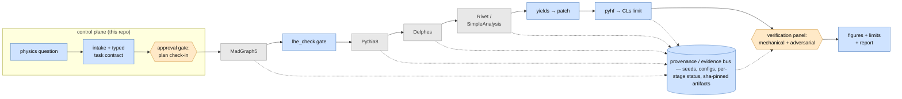
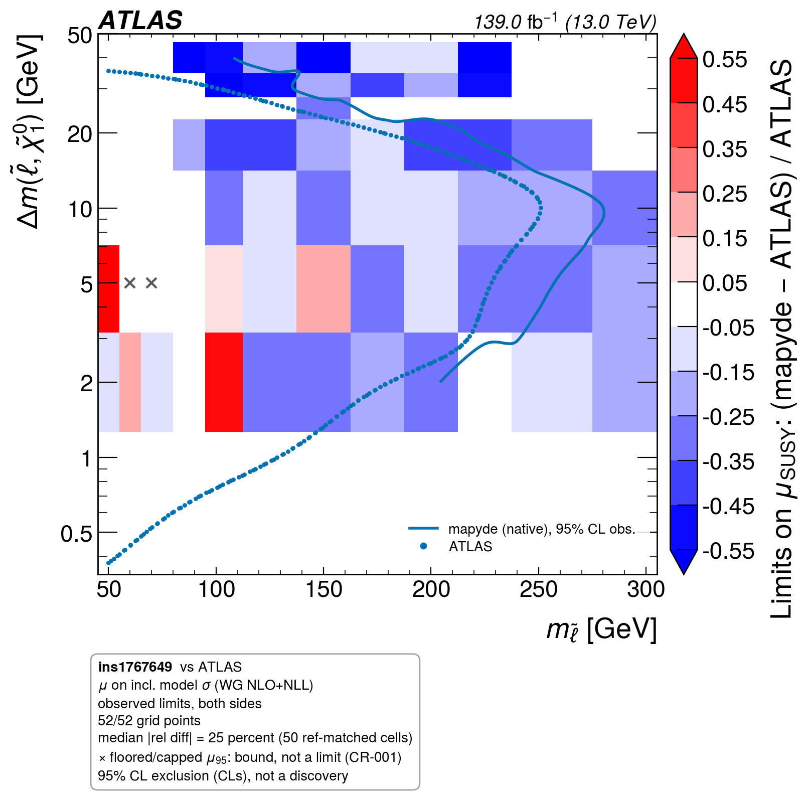

# Ravel-HEP

**A research pipeline for collider reinterpretation, with explicit validation, approval,
provenance, and refusal requirements.**

[](https://github.com/ammarphp/ravel/actions/workflows/ci.yml)


Built on the standard HEP toolchain (MadGraph5_aMC@NLO → Pythia8 → Delphes →
Rivet/SimpleAnalysis → pyhf); **this repository contributes the control plane around it**:
routing, typed task contracts, human-approval gates, provenance and evidence pinning, a
validation harness, and the native-ARM64 performance work. The physics generators are the work
of their own authors — see [THIRD_PARTY.md](THIRD_PARTY.md).

> Marked headline values are checked against their declared artifacts. The benchmark
> headline is derived from its recorded S95 inputs and published references.
> [`scripts/claims_check.py`](scripts/claims_check.py) fails if a marked value drifts
> from [`results/manifest.json`](results/manifest.json), and
> [`framework/check_evidence.py`](framework/check_evidence.py) pins the physics headline
> artifacts by sha256 ([EVIDENCE.md](EVIDENCE.md)). These checks establish scoped
> consistency and integrity; they do not establish scientific correctness.

## Results at a glance

| Result | Number | Evidence |
|---|---|---|
| Statistical-layer recovery | <!-- claim:benchmarks_reproduced -->7 observed S95 comparisons within 8.6% (statistical layer)<!-- /claim --> across 4 searches, from the historical baseline | [docs/validation/](docs/validation/README.md) |
| Native ARM64 port | 8h55m → 41m47s (<!-- claim:arm64_speedup -->12.8x<!-- /claim -->); <!-- claim:arm64_output_parity -->141/141 signal regions identical; final limit delta 0.51%<!-- /claim --> | [docs/arm64-case-study.md](docs/arm64-case-study.md) |
| Flagship reproduction | full 52-point ATLAS mass-plane scan; <!-- claim:fig3_residual -->24.9% median same-basis residual<!-- /claim --> in pointwise cross-section limits; 50 matched cells from 52 points | [scan record](trial-runs/sleptonscan_fig3_SCAN/RESULT.md) |
| Selection acceptance × efficiency | 6 scorable baseline cases: 4 PASS, 1 WARN, 1 FAIL; 3 further cases unscorable | [all 9 cases](docs/validation/README.md) |
| Verification surface | Test suite and <!-- claim:adversarial_gate_cases -->30<!-- /claim --> adversarial gate cases; results report failures and skips separately | CI runs of this repo |
| Native analysis ports | <!-- claim:native_ported_routines -->3<!-- /claim --> routines bit-for-bit vs the containerized original (141/141 · 10/10 · 9/9 signal regions) | [porting recipe](workflow/reference/native-pipeline.md) |
| Scale exercised | <!-- claim:scan_scale -->2.08M events across two 52-point scans<!-- /claim --> (historical generation record) | [results/manifest.json](results/manifest.json) |

<!-- CAPABILITY-STATUS:HEADLINE:BEGIN (auto-generated by framework/gen_status.py from
     framework/capability-matrix.json — DO NOT EDIT inside these markers) -->
**Reference-task coverage 0.64 (WARN)** on the project's benchmark of 7 reference physicist tasks — real requests collected from CERN researchers, used as the standing coverage yardstick (internal audit dimension "R9"). **2 of 7 fully served** (P1 summary track, P4 shape-fit engine; 0 served by a designed refusal), **5 partially served** (P2, P3, P5, P6, P7), **0 not yet built**. Task list, scoring, and definitions: `framework/capability-matrix.json` → `framework/AUDIT.md`. These are internal coverage categories, not measured autonomous success rates or a percentage of scientific correctness. The live audit inventory score depends on which development artifacts are installed.
<!-- CAPABILITY-STATUS:HEADLINE:END -->

## Architecture



Grey = upstream physics tools (invoked, not authored here). Blue = project-owned components.
Orange = the human-approval and verification gates. The execution chain has
<!-- claim:execution_stages -->8<!-- /claim --> gated stages, each writing PASS/FAIL status
lines that the provenance layer and the verification panel consume.

## Quickstart — replay mode, under 5 minutes

The full HEP stack is a heavyweight install, so the quickstart runs **replay mode**: it
re-validates the cached benchmark artifacts through the *real* statistics, provenance, and gate
layers. This exercises a bounded cached replay without MadGraph.

```bash
git clone https://github.com/ammarphp/ravel.git
cd ravel
python3.12 -m venv .venv-replay
.venv-replay/bin/python -m pip install --require-hashes -r requirements-replay.lock
.venv-replay/bin/python -m pip install --no-deps .
.venv-replay/bin/ravel replay --out /tmp/ravel-replay-first
```

Use a new output directory for each run. The wheel also works outside this checkout.
See [CLI and lock details](docs/CLI.md) for validation, audit, packaging, and dependency updates.

Expected output: the fast benchmark case's row — statistical S95 recovery, verdict
tier, provenance check — ending in `GATE: OK`. (Re-scoring the full benchmark set needs
dev-side simulation artifacts; the committed per-case results are in
[docs/validation/](docs/validation/README.md).) Then, optionally: `make claims` re-verifies every
number in this README against its artifacts; `cd framework && python -m pytest tests -q` runs
the full suite; and the adversarial gate board runs with
`bash trial-runs/_infrastructure/install_git_hooks.sh && python3 framework/spine_sim/run_spine_sim.py --require-all`
(the hook install is required — git does not clone hooks, and one gate asserts the
pre-commit gate is genuinely installed, not merely present).

**Full pipeline** (real event generation; heavyweight): provisioning is documented in
[workflow/steps/01-environment.md](workflow/steps/01-environment.md). A single 50k-event
pipeline point runs in ~42 minutes on an Apple-silicon laptop. **Physicist sessions** enter via
[workflow/INITIATE.md](workflow/INITIATE.md): ask a physics question, get a plan with the
published figures it will reproduce and a cost estimate, and nothing heavy runs before your
go-ahead.

## What this actually is

A physicist asks a question — *"is a 175 GeV slepton with a 15 GeV splitting excluded?"*, or
*"reproduce Figure 5 of this paper, then push the width up"*. The system routes it into a typed
task contract, surveys what exists online for the target analysis (routines, likelihoods,
efficiency maps), presents a plan with the published figures it will reproduce, and **stops for
human approval before spending any compute**. After approval it simulates the model through the
standard chain, runs the published analysis selection, and produces the signal-over-data
comparison plus a 95% CL exclusion limit — never a discovery claim. A verification panel
(mechanical number-tracing plus a fresh-context adversarial review armed with the project's own
failure catalogue) must pass before anything is delivered.

The research question is whether enforceable scientific controls improve warranted delegation: typed contracts between stages, machine-checked
claim-to-artifact evidence, per-gate adversarial tests that prove each guard actually fires, and
codified judgment protocols ([eight operating
procedures](workflow/checklists/judgment-protocols.md)) for the decisions that cannot be
automated. Existing agentic HEP systems overlap with this architecture. A causal benefit
from these controls has not been established. The [competitive assessment and preregistered
experiment design](docs/research/2026-09-05-competitive-design-and-validation.md) separate
engineering mechanisms from outcomes that still need to be measured.

<!-- CAPABILITY-STATUS:SHAPEFIT:BEGIN (auto-generated by framework/gen_status.py from
     framework/capability-matrix.json — DO NOT EDIT inside these markers) -->
~40% of the search population (8/20, pre-registered census) is shape/template-fit; these route to the scoped `shape_fit.py` engine (`stat_mode=shape-fit`), R5-gated per analysis. Only an unrepresentable fit (unbinned / multi-observable / per-event NN) downgrades to the named `blocked-shape-fit` refusal + generator-level offer (PRODUCT-CONTRACT §6.1). Matrix: P4 served, G2b built.
<!-- CAPABILITY-STATUS:SHAPEFIT:END -->

## Three separate validation questions

**Statistical-layer S95 recovery.** Seven comparisons across four searches recover the
published model-independent upper bound on signal events in the driving signal region.
This checks statistical inputs and inference. The table describes the committed historical
baseline; CI freshly re-fits the single bundled fast case.

**Selection acceptance × efficiency.** Six of the nine baseline cases are scorable, with
four PASS, one WARN and one FAIL; three have no acceptance reference. A locked regression
floor can pass even when the certification verdict is FAIL. Native/container implementation
parity is a further distinct check and does not certify agreement with experiment.

**End-to-end mass-plane fidelity.** The flagship scan measures the pointwise cross-section
limit residual over a two-dimensional model plane. That result carries its own comparison
basis, coverage, unresolved mechanisms, and excluded legacy cells.

[All nine validation pages](docs/validation/README.md) retain the failures and unscorable cases.
The [September hardening audit](docs/development/2026-09-05-hardening.md) records the fresh
local replay, including missing-artifact breaches. Historical green rows are not current certification.

| Analysis / case | Δ (obs) | Page |
|---|---|---|
| ATLAS squark pair, plain + ME/PS-merged | 0.2% / 0.2% | [page](docs/validation/ins1458270_squark_800_100.md) |
| ATLAS gluino pair, plain + merged | 5.4% / 5.9% | [page](docs/validation/ins1458270_gluino_1000_100.md) |
| ATLAS monojet dark-matter axial | 2.3% | [page](docs/validation/ins1452559_dm_axial_850_1.md) |
| ATLAS gluino one-step | 8.6% | [page](docs/validation/conf2016054_gluino_onestep_1500_60.md) |
| ATLAS gluino two-step with sleptons | 8.2% | [page](docs/validation/conf2016037_gluino_2step_sleptons_1400_60.md) |

Beyond the gate, the flagship result reproduces the central figure of the mapyde reference
paper (arXiv:2306.11055): the ATLAS compressed-slepton search ATLAS-SUSY-2018-16
(EwkCompressed2018) scanned across ATLAS's own 52-point mass plane (native, laptop, no
VM), overlaid on the published exclusion contour with a per-cell difference map — and an honest
24.9% median residual. A paired 52-point rescan measured a +6.5% PDF-choice contribution;
the remaining residual has not been completely causally attributed. Details are in the
[scan record](trial-runs/sleptonscan_fig3_SCAN/RESULT.md).

<p align="center"></p>

**The adversarial harness** — 30 gate cases ([framework/spine_sim/](framework/spine_sim/)), one
per workflow-adherence gate: each case fabricates the violating state (a compute launch without
an approval artifact, a tampered enforcement file, a hand-written provenance record, a stage
sequence drift, a delivery containing an unverified number) and asserts the gate *fires*.
Failure behavior is rejection at the gate — the tool call or session is blocked, not
flagged-and-continued.

**Cross-stage checks** enforced mechanically, with examples: event-count conservation (generated
vs card, `lhe_check`), cross-section basis consistency (comparisons refuse to run across
mismatched σ conventions), seed + config provenance completeness per run, sha256-pinned
claim-to-artifact evidence ([EVIDENCE.md](EVIDENCE.md)), µ95 re-fit stability tolerance in the
benchmark gate, and figure-layout linting (a legend occluding data fails the render). An
independent cross-check layer re-derives exclusions through SModelS on the same points.

## ARM64 case study

The reference pipeline's analysis stage only runs x86, so on Apple silicon the whole chain ran
under emulation: 8h55m for one 50k-event point. Porting the execution substrate natively —
including a from-scratch reimplementation of the one x86-only analysis component — brought the
identical point to 41m47s (12.8×) and unlocked parallel scan points. Correctness was accepted on
three grounds: bit-identical converters, 141/141 signal-region outputs identical on shared
input, and an independent fresh-generation run reproducing the reference limit to 0.51%. Both
timing artifacts (per-stage `STATUS.txt` timestamp logs) are committed; methodology and
stage-by-stage table: [docs/arm64-case-study.md](docs/arm64-case-study.md).

## The agentic layer, honestly

- Built with Claude Code (Anthropic); development used frontier models, and the workflow is
  routinely exercised by cheaper models (routing evals run fresh smaller-model sessions against
  the real prompt set — 7/7 pass on the current board, transcripts graded).
- The agent may: survey public resources, propose plans, run gated simulation stages after
  approval, produce figures and limits, and file its own failure records.
- The agent may not: launch generation before the plan check-in is approved (a pre-execution
  hook blocks the command), take physics-judgment steps silently (they escalate with numbered
  flags), edit its own enforcement layer during physics sessions, or deliver numbers that fail
  the verification panel.
- Failure modes actually observed (full catalogue:
  [framework/FAILURE-CATALOGUE.md](framework/FAILURE-CATALOGUE.md)): rendering a "reproduction"
  from a figure caption without extracting the real figure; comparing limits across mismatched
  cross-section bases (a spurious 33% residual until caught and rebased to 24.9%); a silent
  optimizer failure returning CLs≡1.0 on projected workspaces (now guarded by a minuit-first
  monotonicity audit).
- Developed with heavy use of agentic tooling (Claude Code); every generated change passes the
  same test suite, adversarial harness, and benchmark validation as hand-written code.

## Repo map

| Path | What |
|---|---|
| `workflow/` | the operational method: 9 steps, checklists, the physicist entry point (`INITIATE.md`) |
| `trial-runs/_infrastructure/` | existing simulation engines, orchestrators, and gates; packaged entry points live in `src/ravel/` |
| `framework/` | quality bar: benchmark gate, evidence manifests, audits, failure catalogue, registries |
| `framework/tests/` + `framework/spine_sim/` | the test suite and adversarial gate board |
| `trial-runs/<run>/` | curated evidence per run: configs, logs, curated outputs, `RESULT.md` |
| `docs/` | validation pages, the ARM64 case study |
| `results/manifest.json` | every README number → its generating artifact |
| `.claude/` | agent skills, rules, and the enforcement hooks |
| `pedagogical/` | learning-track notes (separate from the operational docs) |

## Limitations

- Detector simulation is Delphes-level fast-sim; the intrinsic acceptance floor (~10–20% on
  compressed spectra) is a possible contributor to the flagship residual, not a demonstrated
  complete causal explanation. No Geant4.
- The native SimpleAnalysis backend covers 3 bit-for-bit-validated routines plus a declarative
  engine for cut-based selections; unported SimpleAnalysis routines still take the (slow,
  emulated) container path, and the two newest ports remain barred from serving full results: their
  August acceptance certifications completed with FAIL verdicts. The Rivet path is native everywhere.
- Roughly 40% of surveyed searches are shape-fit-based; the scoped fit engine serves these only
  when its per-analysis validation gate closes against the published limit — otherwise the
  system refuses with a named reason rather than improvising.
- Signal σ is LO with working-group k-factors where published grids exist; PDF and scale
  uncertainty bands are not propagated into limits.
- Scans parallelize per-point on one machine; there is no distributed scheduler.
- The benchmark set skews toward ATLAS SUSY searches — that is where published routines,
  likelihoods, and cutflows are richest.
- A full agentic run costs real LLM tokens; replay mode exists partly so validation is free.

## License & contact

Built on MadGraph5_aMC@NLO, Pythia8, Delphes, Rivet, ATLAS SimpleAnalysis, RestFrames, pyhf,
SModelS, MadAnalysis 5, and the mapyde reference pipeline (arXiv:2306.11055) — see
[THIRD_PARTY.md](THIRD_PARTY.md) and [CITATION.cff](CITATION.cff).

Apache-2.0. Contact: ammarabdullahaziz@gmail.com.

*Curated distribution of an active research repository. Sanitized updates append to public
history; raw development records and heavy regenerable artifacts remain in the working repository.*
