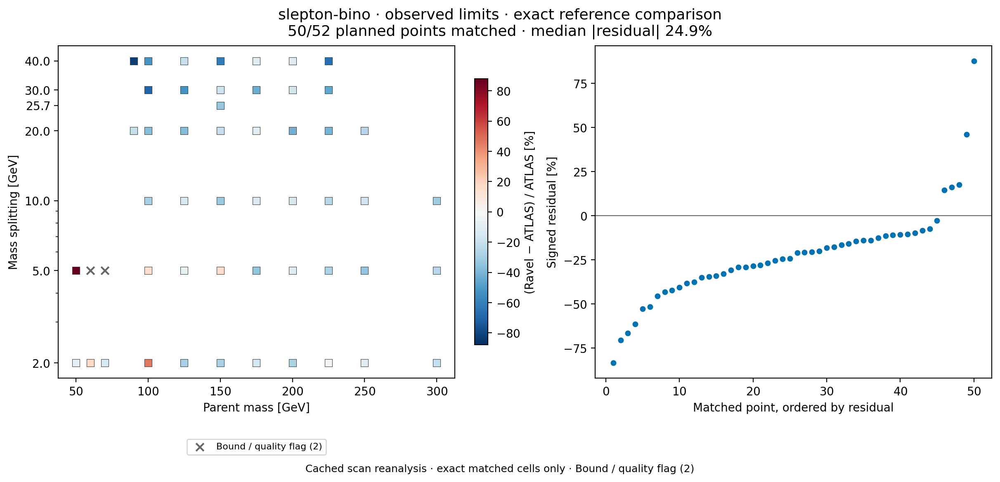

# Ravel-HEP

Ravel helps collider-physics researchers turn a reinterpretation question into a
reviewable calculation: define the physics task, prepare a simulation plan, run
the analysis, compute exclusion limits, and check the artifacts behind the result.

[](https://github.com/ammarphp/ravel/actions/workflows/ci.yml)
[](LICENSE)

It connects MadGraph, Pythia, Delphes, Rivet or SimpleAnalysis, and pyhf through
explicit task contracts, run state, provenance checks, and validation. Use the
Python CLI for initiation, contract validation, and cached statistical replay.
Full simulations use the separately installed native HEP toolchain and the
[physics workflow](docs/workflow/start.md).

[Installation](docs/installation.md) · [CLI reference](docs/cli.md) ·
[Supported analyses](docs/reference/capabilities.md) ·
[Validation results](docs/validation/results.md) · [Documentation](docs/README.md)

## What a result looks like

A run produces machine-readable yields and limits, figures, provenance records,
and a report explaining the comparison with published results. A mass-plane scan
adds per-point coverage and an exclusion contour. Missing points, quality bounds,
and failed comparisons remain visible.

Limits carry explicit observed/expected roles and distinguish resolved crossings
from scan bounds. Result packs bind to their inference inputs, and resumed stages
reuse outputs only while their recorded dependencies remain current. See the
[result contracts](docs/reference/scientific-results.md) and
[execution and recovery guide](docs/workflow/reference/durable-execution.md).



**Compressed-slepton example.** This figure freshly re-renders a recorded
52-point scan against the published ATLAS upper-limit grid. Fifty points have
exact reference matches; two legacy bounds are excluded from residuals and
retained in the coverage count. The observed-limit comparison has a
<!-- claim:fig3_residual -->24.9% median same-basis residual<!-- /claim -->.
These are historical interpolated limits, whose numerical precision is not certified.
The [RRR diagnosis](evidence/audits/2026-09-05-rrr-diagnosis/README.md) compares three
retained campaigns and exposes coarse limit interpolation, incomplete detector
samples in a rescan, and confounded generator comparisons. A [fixed-template
refit](evidence/audits/2026-09-05-rrr-refits/README.md) removes the prominent low-mass
red cell's numerical excess without retuning physics. The remaining disagreement
is unresolved; this figure is not a general accuracy guarantee.
The [figure, inputs, and per-point JSON](evidence/audits/2026-09-05-scan-fidelity/README.md)
are available alongside the [original scan record](evidence/scans/slepton-bino-figure-3/RESULT.md).

The evidence checks answer different questions:

| Check | Recorded evidence | What it establishes |
|---|---|---|
| Statistical recovery | <!-- claim:benchmarks_reproduced -->7 observed S95 comparisons within 8.6% (statistical layer)<!-- /claim --> | Recovery from published statistical inputs, across four searches |
| Implementation comparison | <!-- claim:arm64_output_parity -->141/141 signal regions identical; final limit delta 0.51%<!-- /claim --> | A bounded native/container comparison on recorded inputs |
| Selection fidelity | Six scorable historical cases: four PASS, one WARN, one FAIL; three additional cases unscorable | Agreement with published acceptance × efficiency where comparable evidence exists |
| Workflow guards | <!-- claim:adversarial_gate_cases -->30<!-- /claim --> constructed gate cases | Responses to specified invalid states; not an agent-task success rate |

See [all nine benchmark cases](docs/validation/README.md) for the complete
population and [validation results](docs/validation/results.md) for provenance,
limitations, and the distinction between regression floors and certification.
Registered headline values in this README and the detailed results page are
checked against the same [claim registry](evidence/claims.json).

## Install and run your first replay

The package is `ravel-hep`; the executable and Python import are `ravel`.
These commands install from the repository, without assuming a PyPI release.
Use Python 3.12 for the committed dependency lock:

```bash
git clone https://github.com/ammarphp/ravel.git
cd ravel
python3.12 -m venv .venv-replay
.venv-replay/bin/python -m pip install --require-hashes -r requirements-replay.lock
.venv-replay/bin/python -m pip install --no-deps .
.venv-replay/bin/ravel --help
.venv-replay/bin/ravel replay --out local-runs/replay-example
```

The lock verifies dependency hashes; `--no-deps` prevents the package installation
from replacing those dependencies. Alternative `uv` commands and development
setup are in the [installation guide](docs/installation.md).
The examples keep generated outputs under ignored `local-runs/`.

A successful replay ends with `GATE: OK`. It writes:

```text
local-runs/replay-example/
├── environment.json   # Python, dependencies, platform, and bundle fingerprint
├── results.json       # Fresh checks and their explicitly labeled scope
└── work/              # Statistical outputs and subprocess logs
```

The replay works outside the checkout after installation and needs no further
network access. It freshly fits the bundled fast benchmark using cached
simulation inputs; acceptance certification may come from the recorded baseline.
It does not generate events. Choose a new output directory for each attempt;
failed attempts are retained too.

To regenerate the scan demonstration from the checkout, using the same environment:

```bash
.venv-replay/bin/python benchmarks/plot_scan_demo.py --out local-runs/scan-example
```

This writes PNG/PDF figures, an exact-match comparison JSON, and input/output
hashes. It re-renders recorded data without changing the original scan or running
new physics inference.

## Initiate a physics task

Create a draft contract and initial run state from your request:

```bash
.venv-replay/bin/ravel initiate \
  --prompt 'Initiate: reproduce Figure 16a of arXiv:1911.12606 for a slepton-bino model' \
  --out local-runs/slepton-study
.venv-replay/bin/ravel validate \
  local-runs/slepton-study/inputs/task_contract.json --json
.venv-replay/bin/ravel status --rundir local-runs/slepton-study
```

The local router records a draft interpretation; an agent can also supply a
request-bound interpretation with literal supporting spans. Review it: a valid
contract is a structural check, not approval, a resolved analysis implementation,
or evidence that the requested result is feasible. Initiation does not launch
simulation or call an LLM. See the [CLI reference](docs/cli.md) for the output
files and failure behavior.

For an agent-assisted session, open the checkout in your coding agent and use the
same **“Initiate:”** request. The repository's workflow instructions guide the
agent through the analysis survey, input review, proposed figure, resource budget,
and **CHECK-IN 1** plan. Your approved plan is required before event generation.
The [workflow entry point](docs/workflow/start.md) explains the check-ins and how
to resume from recorded state.

A full calculation follows generation → shower/detector simulation → event
selection → statistical inference → validation → result artifacts. Provision
its toolchain using the [environment guide](docs/workflow/steps/01-environment.md)
and [native pipeline instructions](docs/workflow/reference/native-pipeline.md).
The replay installation alone does not install MadGraph, Pythia, or detector tools.
For Intel and Apple Silicon Macs, use the [native doctor and build helpers](docs/reference/native-portability.md)
to check architecture, dependencies and explicit tool prefixes before provisioning.
Check [capabilities](docs/reference/capabilities.md) before choosing an analysis;
backend and validation coverage differ by routine.

## Improving physics fidelity


**An isolated correction on retained events.** The three-lepton eRJR selection
previously evaluated the invisible momentum in a different frame from the leptons
inside one boost-dependent quantity. Applying the ATLAS definition changes SRlow
from 43 to 95 selected events on the same 200,000-event sample. Its acceptance
shortfall falls from 65.2% to 23.1%; the ISR signal region remains at 19 events.
The remaining mismatch still **fails** the existing acceptance threshold. This is
cached reanalysis with one calculation changed, not a fresh end-to-end simulation.
The [differential audit](evidence/audits/2026-09-05-native-fidelity/README.md)
records stage counts, changed event IDs, input hashes, and the published definition.

Ravel also checks numerical failure modes: nonfinite inputs, missing reference
data, scan ceilings, CLs crossing accuracy, and unsupported interpolation. The
[hardening report](docs/development/history/2026-09-05-physics-fidelity.md) describes
these changes and their tests. The [landscape review](docs/research/2026-09-05-fidelity-and-validation-landscape.md)
compares lessons from MadAgents, ColliderAgent, established recasting tools, and
statistical tooling. Statistical superiority has not been established by a
controlled comparison; inference correctness and detector fidelity need separate
evidence.

The [RRR diagnosis and research program](docs/research/2026-09-05-rrr-diagnosis-and-research-program.md)
separates numerical, likelihood, normalization and detector failures using retained
inputs and controlled refits. The [public HEP analysis survey](docs/research/2026-09-05-public-hep-analysis-landscape.md)
maps 26 candidates to distinct reuse methods and required admission evidence.
These are measured diagnostics and proposed extensions, not newly validated analyses.

## Explore, contribute, and cite

Code lives in `src/ravel/`, native bridges in `native/`, reference workflows in
`docs/`, and test definitions in `benchmarks/` and `tests/`. The public `evidence/`
collection retains selected results and their original source identities. See
[repository layout](docs/development/repository-layout.md) for naming and contents.

Use [CONTRIBUTING.md](CONTRIBUTING.md) for tests and development setup, and
[GitHub Issues](https://github.com/ammarphp/ravel/issues) for reproducible problems.
Ravel is research software; consult the [limitations](docs/reference/limitations.md)
before applying it to a new analysis. Citation metadata is in [CITATION.cff](CITATION.cff),
with [upstream acknowledgements](docs/reference/third-party.md). Licensed under
[Apache-2.0](LICENSE).
