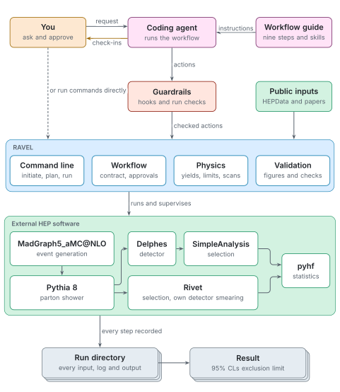
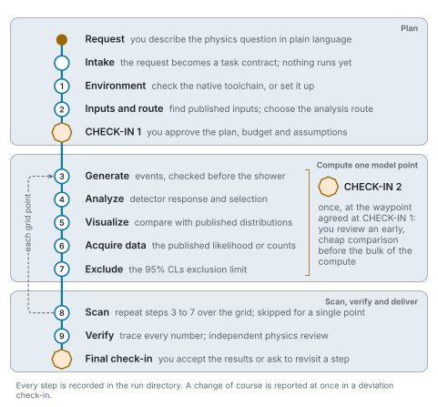
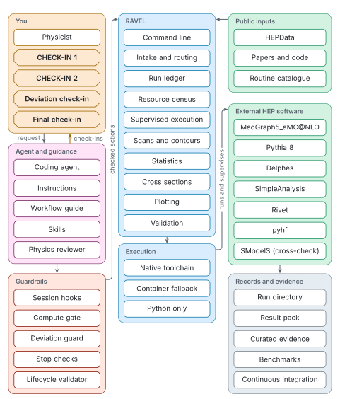

# RAVEL

RAVEL reinterprets published LHC searches. You ask a physics question in plain language, a coding agent plans the
calculation and stops for your approval, and the `ravel` package runs and checks MadGraph5_aMC@NLO, Pythia 8,
Delphes with SimpleAnalysis or Rivet, and pyhf. The result is a 95% CLs exclusion limit with the evidence behind it.

[](https://github.com/ammarphp/ravel/actions/workflows/ci.yml)
[](LICENSE)
[](pyproject.toml)

[Install](#install) · [Quick start](#quick-start) · [How RAVEL works](#how-ravel-works) · [Commands](#commands) ·
[Capabilities](docs/reference/capabilities.md) · [Validation](docs/validation/results.md) ·
[Limitations](#limitations) · [Documentation](#documentation)

> [!NOTE]
> RAVEL is research software, version 0.4.0. Install it from this repository: the package is not on PyPI, and
> `pip install ravel` installs an unrelated project. Support and validation differ from analysis to analysis, so
> read [Limitations](#limitations) before you start a new study.

## What RAVEL does

RAVEL does:

- turn a request into a task contract and a run ledger that record what was asked and what happened;
- survey what has been published (HEPData records, analysis routines, the paper's figures) and show you a plan at
  **CHECK-IN 1** before any events are generated;
- run each stage under supervision, so a long run can be resumed;
- compute 95% CLs limits for one model point, and scan a grid of points into an exclusion contour;
- record every step, and keep failed or missing points visible;
- offer smaller routes: a cached replay, likelihood-only and generation-only runs, studies of events or models you
  already have, and a catalogue of analysis routines.

RAVEL does not:

- claim discoveries or quote p-values for new physics;
- generate events without a recorded approval;
- treat a passing software check as physics certification.

## Install

You need Git and Python 3.10 to 3.12; the hash-locked environment below uses Python 3.12. The Python package runs on
macOS and Linux. The HEP simulation tools are installed separately, and only for event generation (see
[Toolchain and platforms](#toolchain-and-platforms)).

```bash
git clone https://github.com/ammarphp/ravel.git
cd ravel
python3.12 -m venv .venv-replay
.venv-replay/bin/python -m pip install --require-hashes -r requirements-replay.lock
.venv-replay/bin/python -m pip install --no-deps .
.venv-replay/bin/ravel --help
```

The lock file pins and verifies every dependency; `--no-deps` stops the package installation from changing them. The
package is `ravel-hep`; the command and the Python import are `ravel`. Commands with `uv`, and the development setup,
are in the [installation guide](docs/installation.md).

<details>
<summary>Optional extras</summary>

| Extra | Adds | Needed for |
|---|---|---|
| `replay` | pyhf, NumPy, SciPy, Matplotlib | Replay and statistics (already in the lock file) |
| `science` | mplhep, uproot | Figures and ROOT files in supplied-data studies |
| `measurement` | Spey | Measurement inference |
| `classifier` | ONNX Runtime | Studies that use a trained classifier |
| `test` | pytest | Running the test suite |

</details>

The examples below write their outputs under `local-runs/`, which Git ignores.

## Quick start

### 1. Check the installation

```bash
.venv-replay/bin/ravel replay --out local-runs/replay-example
```

This takes under a minute, needs no network access after installation and works from any directory if you call `ravel`
by its full path. It refits a bundled benchmark, the ATLAS 2016 squark search (arXiv:1605.03814) at a squark mass of
800 GeV and a neutralino mass of 100 GeV, through pyhf from cached inputs. It does not generate events, and its
acceptance check is taken from the recorded baseline and labelled `cached_replay`: the replay is a regression check,
not a new analysis. It prints `GATE: OK` and writes `environment.json` (Python, dependencies, platform and bundle
fingerprint), `results.json` (fresh checks and their labelled scope) and `work/` (statistical outputs and logs).

Use a new output directory for each attempt; RAVEL refuses to overwrite one, and keeps failed attempts.

### 2. Compute a first limit

This runs the plan, approve and run cycle without an agent, on a counting model bundled with RAVEL: signal region 2jl
of the same ATLAS 2016 squark search, with 263 observed events and 283 ± 24 expected background events at
3.2 fb⁻¹. It takes a few seconds and runs offline. First draft the request and make the plan:

```bash
.venv-replay/bin/ravel initiate \
  --prompt "Compute a likelihood-only check from the supplied counting model." \
  --out local-runs/first-limit
.venv-replay/bin/ravel plan --rundir local-runs/first-limit \
  --spec benchmarks/scoped/atlas-2jl-counting.json
```

Read the plan before you approve it: CHECKIN1.md in the run directory, and the `inputs/checkin1.json` it points to,
give the recipe, the source, the assumptions and the 120-second ceiling. Then approve, in your own words, and run:

```bash
.venv-replay/bin/ravel approve --rundir local-runs/first-limit \
  --quote "I have read the plan and approve this likelihood-only check."
.venv-replay/bin/ravel run --rundir local-runs/first-limit
.venv-replay/bin/ravel status --rundir local-runs/first-limit --write
```

Your quote is recorded as the approval, and `status` reports the lifecycle verdict `PASS`. The result is in
`outputs/RESULT.md`. It starts with an observed 95% CLs limit of 43.651372 and a median expected limit of 54.884401
signal events. This check uses a single-bin counting approximation, not the experiment's full likelihood.

### 3. Ask a coding agent

Open this repository in your coding agent and type your request, for example "Reproduce Figure 16a of
arXiv:1911.12606 for a slepton-bino model". The agent drafts the task contract in its own run directory under
`trial-runs/`, where the repository's guardrails look, surveys the published inputs and stops at CHECK-IN 1. Nothing
is generated until you approve. See [Working with a coding agent](#working-with-a-coding-agent).

## How RAVEL works

<picture>
  <source media="(prefers-color-scheme: dark)" srcset="docs/figures/svg/dark/overview.svg">
  
</picture>

Colours: amber is you and the check-ins, pink the agent, red the guardrails and required checks, blue RAVEL, green
external software and public data, grey the records.

| Part | What it does |
|---|---|
| You | Ask the question, and approve the plan at CHECK-IN 1 and the scale-up at CHECK-IN 2. You can also run `ravel` yourself. |
| Coding agent | Follows the workflow guide and drives RAVEL. |
| Workflow guide | The nine steps, each with a written procedure, and skills for recurring tasks. |
| Guardrails | Check the agent's actions as they happen: for example, no event generation without a recorded approval. |
| Public inputs | HEPData records, papers and public analysis code that RAVEL reads. |
| RAVEL | The `ravel` package: the command line, the workflow and run ledger, the physics and statistics code, figures and validation. |
| External HEP software | MadGraph5_aMC@NLO, Pythia 8, Delphes, SimpleAnalysis, Rivet and pyhf, run and supervised by RAVEL. |
| Run directory and result | Holds the task contract, approvals, logs, outputs and the result, so every number can be traced. |

<details>
<summary>Terms used in this README</summary>

- **Task contract**: your request in structured form: the analysis, model, target figure and masses.
- **Check-in**: a message to you at a set point in a run. CHECK-IN 1 and CHECK-IN 2 are gates: heavy compute waits
  for your answer. A deviation check-in reports a change of course; the run continues.
- **Gate** and **hook**: a gate blocks an action until its condition is met; hooks are scripts that a coding agent
  runs automatically at set moments, and they apply the gates.
- **Lifecycle validator**: checks that a run's required stages, approvals and records exist and are in order. Its
  verdict is `PASS` or `FAIL`.
- **Scoped run**: one fixed calculation described in a JSON spec, planned with `ravel plan` and run once with
  `ravel run`, without an agent.
- **Native** and **container fallback**: native tools are installed directly on your Mac; the container fallback is a
  prebuilt x86 container for SimpleAnalysis routines without a native port, about 9 hours per point.
- **Result pack**: the machine-readable result files from which `RESULT.md` is written.
- **Sensitivity only**: the expected reach of a search, not an exclusion.

</details>

Each step, and the check-ins, guardrails, records and execution backends, has its own page in
[the architecture pages](docs/architecture/README.md).

## How a calculation runs

<picture>
  <source media="(prefers-color-scheme: dark)" srcset="docs/figures/svg/dark/lifecycle.svg">
  
</picture>

First comes **intake**: your request becomes a task contract (analysis, model, figure, masses). Nothing runs. Then:

1. [**Environment**](docs/architecture/stage-1-environment.md): check the native toolchain, or set it up.
2. [**Inputs and route**](docs/architecture/stage-2-inputs.md): find the published inputs and choose the analysis
   route. Then **CHECK-IN 1**: you approve the plan, budget and assumptions.
3. [**Generate**](docs/architecture/stage-3-generate.md): generate events and check them before the shower.
4. [**Analyze**](docs/architecture/stage-4-analyze.md): apply the detector response and the analysis selection.
5. [**Visualize**](docs/architecture/stage-5-visualize.md): compare the signal with the published distributions.
6. [**Acquire data**](docs/architecture/stage-6-acquire-data.md): fetch the published statistical model: the
   likelihood, or per-region counts.
7. [**Exclude**](docs/architecture/stage-7-exclude.md): compute the 95% CLs limit.
8. [**Scan**](docs/architecture/stage-8-scan.md): repeat steps 3 to 7 over a grid and draw the contour.
9. [**Verify**](docs/architecture/stage-9-verify.md): trace every number and review the physics. Then the **final
   check-in** delivers the results, for you to accept or send back.

**CHECK-IN 2** comes once, at the waypoint agreed at CHECK-IN 1: an early, cheap comparison with part of a published
figure, before the bulk of the compute. A change of course is reported at once in a deviation check-in and recorded;
the run continues. The replay and likelihood-only routes run only the statistics part of this sequence; a
generation-only run stops at parton-level events. To resume a run, rebuild its state with `ravel status --rundir <run>
--write`; never start it again.

## Working with a coding agent

Open this repository in your coding agent and describe the task in plain language. The agent follows
[the workflow start guide](docs/workflow/start.md): it surveys the published inputs, proposes a target figure, a
budget and assumptions, and stops at CHECK-IN 1. No events are generated, not even a small test run, before you
approve.

Coding agents that support the repository's hook settings enforce the gates automatically. Other agents read
[AGENTS.md](AGENTS.md) and the skills and follow the same gates from the written instructions; on those hosts the
agent runs each check itself, including the lifecycle validator before delivery, and nothing enforces this
automatically. Agent runs are stored under `trial-runs/`, one directory per run; see
[the run-directory guide](docs/workflow/run-directory.md).

## Commands

| Route | Use it when | Needs |
|---|---|---|
| Agent workflow | You want a full reproduction, reinterpretation or scan | A coding agent; the native toolchain for event generation |
| Scoped likelihood-only | You have a published likelihood or a counting model | Python only |
| Scoped generation-only | You want parton-level events for a declared process | An installed native MadGraph5_aMC@NLO |
| Supplied events or models | You already have events, weights or a model to study | Python, with the matching extras |
| Cached replay | You want to check an installation | Python only |
| Analysis discovery | You want to know which routines exist for an analysis | Python only |

The scoped and supplied-data routes are described in [scoped workflows](docs/workflow/reference/scoped-workflows.md)
and [scientific studies](docs/workflow/reference/scientific-studies.md).

| Command | What it does |
|---|---|
| `ravel initiate` | Draft a task contract and an empty run ledger from a request; runs no compute |
| `ravel plan` | Prepare a concrete CHECK-IN 1 for a scoped or supplied-data run; runs no compute |
| `ravel approve` | Record your approval, bound to that CHECK-IN 1 |
| `ravel run` | Run one approved scoped attempt; `--resume` checks a finished attempt without rerunning it |
| `ravel status` | Rebuild the current state of a run from its records |
| `ravel validate` | Check a task contract; never authorises compute |
| `ravel compare-recipes` | Compare runs only when their executed recipes are verified |
| `ravel replay` | Refit the bundled benchmark from cached inputs |
| `ravel audit` | Inspect a checkout against the readiness criteria |
| `ravel analyses` | Search the catalogue of analysis routines (`list`, `show`, `check-source`, `summary`) |

Exit code 0 means the command completed (a status or audit report can still list failures), 1 means a check failed
or a request is unsupported, and 2 means a usage or input error. The [CLI reference](docs/cli.md) has every option
and output file.
`ravel initiate` runs no simulation and calls no AI model; a coding agent can add its own reading of the request with
`--interpretation`. A fresh draft's `status` reports `FAIL` and lists the stages still to run; it passes only when
every required stage has run and been checked.

## Supported analyses and statistics

Three SimpleAnalysis routines run on the native toolchain:

| Routine | Models | Statistics |
|---|---|---|
| `EwkCompressed2018` | Slepton–bino | Yields, compressed likelihood or explicit channel mapping |
| `EwkThreeLeptonERJR2018` | Chargino–neutralino via WZ | Yields or explicit channel mapping |
| `ZeroLeptonDiscovery2018` | Squark– and gluino–neutralino | Yields only |

Other SimpleAnalysis routines can run only through the slow container fallback, if its image includes them. Rivet
routines run with their own detector smearing in counting mode. Published efficiency maps can be folded without
detector simulation. Binned shape fits are used only after the paper's own limit is reproduced. A custom
particle-level selection is labelled as sensitivity only.

Limits come from a published HistFactory likelihood from HEPData with a signal patch, a counting model or, for binned
shape fits, the shape-fit engine. Results are 95% CLs exclusion limits or, where no exclusion can be claimed, labelled
expected-only sensitivity; never discovery significances. `ravel analyses summary` reports the pinned catalogue of 633
routines (554 Rivet and 79 SimpleAnalysis), and `ravel analyses list` searches it. A catalogue entry means a routine
is available, not that RAVEL supports it; the [catalogue
survey](evidence/audits/2026-09-26-analysis-landscape/README.md) separates the two. The full picture is in
[capabilities](docs/reference/capabilities.md) and the [native pipeline](docs/workflow/reference/native-pipeline.md).

## Toolchain and platforms

| Tool | Tested version |
|---|---|
| MadGraph5_aMC@NLO | 2.9.27 |
| Pythia 8 | 8.312 |
| Rivet, with YODA and HepMC3 | 4.1.3 |
| Delphes, with ROOT and FastJet | Not pinned; see [the recorded environment](docs/reference/environment.md) |
| pyhf | 0.7.6 |
| SModelS, as a cross-check | 3.1.1 |
| Container fallback | mapyde 0.5.0 on podman |

Event generation needs the native toolchain, on macOS 11 or later; it is verified on macOS 15.5 with Apple Silicon.
Check the computer with the read-only health check:

```bash
.venv-replay/bin/python -B -m ravel.validation.native_doctor --json
```

Add `--require-rjr` for routines that use RestFrames (recursive jigsaw reconstruction), such as `EwkCompressed2018`.
If tools are missing, follow [the step 1 procedure](docs/workflow/steps/01-environment.md), or let your coding agent
do it at step 1. Intel helpers are tested in CI, but native runs on Intel Macs and Linux are not verified; there, use
the Python-only routes or the container fallback. A native point takes about 30 to 50 minutes, a container point
about 9 hours, and a scan from hours to overnight; the estimate at CHECK-IN 1 is the one to trust. Event generation
also needs network access and free disk: about 6 GB for each point running at once during a scan. See also
[native portability](docs/reference/native-portability.md).

## Outputs

An agent-workflow run directory, `trial-runs/<date>_<label>/`, holds:

```text
<run>/
├── RESULT.md          # The result, in words, with its figures
├── DEVIATIONS.md      # Every change of course
├── RESUME.md          # Current state and the commands to resume
├── run_state.json     # The run ledger
├── result.json        # The result pack (scan.json for a scan)
├── inputs/            # Task contract, cards, check-ins and approvals
├── outputs/           # Statistical results and validation records
├── plots/             # Figures and their index
└── logs/              # Logs and execution receipts
```

Scoped runs from `ravel run` use a flatter layout: `RESULT.md`, `result.json` and the figure are in `outputs/`.

Limits carry observed and expected values and say whether each crossing was resolved or hit a bound. A scan records
which points finished, failed or are missing. A resumed stage reuses its output only when its recorded inputs, code
and runtime still match. See [scientific results](docs/reference/scientific-results.md),
[durable execution](docs/workflow/reference/durable-execution.md) and the
[run-directory guide](docs/workflow/run-directory.md).

## What RAVEL checks

On a full agent-workflow run that generates events, RAVEL's validators check:

- the task contract and the order of the lifecycle stages;
- that approvals are bound to the inputs you reviewed;
- the generated events, before the shower;
- acceptance times efficiency against published values, before a limit is quoted;
- that a likelihood matches the selection that produced its yields;
- numerical safety: non-finite inputs, missing reference data, scan limits, bracketed CLs crossings and unsupported
  interpolation;
- figures drawn by RAVEL's plotting tools, when they are saved.

At step 9, the verification panel (the agent, with a fresh reviewer) checks every quoted number against the file it
came from. Scoped, replay and supplied-data runs apply only the checks within their scope: approval binding, inputs,
numerical status and receipts.

These checks do not prove that a result is physically correct: inference and detector fidelity need their own
evidence. In the table, S95 is the 95% CL upper limit on the number of signal events.

| Check | Recorded evidence | What it establishes |
|---|---|---|
| Statistical recovery | <!-- claim:benchmarks_reproduced -->7 observed S95 comparisons within 8.6% (statistical layer)<!-- /claim --> | Recovery of published limits from published statistical inputs, across four searches |
| Implementation comparison | <!-- claim:arm64_output_parity -->141/141 signal regions identical; final limit delta 0.51%<!-- /claim --> | For one routine (`EwkCompressed2018`), native and container chains agree on a shared detector-level input (regions) and from independent generation (limit) |
| Selection fidelity | Six scorable cases: four pass, one warning, one fail; three cases cannot be scored | Agreement with published acceptance times efficiency where comparable evidence exists |
| Workflow guards | <!-- claim:adversarial_gate_cases -->29<!-- /claim --> constructed gate cases | Responses to specified invalid states; not a rate of successful agent tasks |

The marked values in this table are checked against the [claim registry](evidence/claims.json) in CI. The [validation
results](docs/validation/results.md) give the provenance and the limits of each check, [all nine benchmark
cases](docs/validation/README.md) are listed separately, and each evidence bundle has an offline verifier ([evidence
index](docs/validation/evidence.md)).

## Limitations

- Detector response is fast simulation (Delphes, or Rivet's smearing), not Geant4.
- Certified runs use Pythia 8's default Monash tune, not the ATLAS A14 tune.
- Higher-order cross sections enter as a flat k-factor; PDF and scale uncertainties are not propagated.
- Decay spin correlations are not modelled in decay-table decays.
- For analyses without a published likelihood, the counting model is an approximation.

See [the full list of known limitations](docs/reference/limitations.md), and [what RAVEL claims](docs/reference/scope.md).

## Documentation

| Goal | Start here |
|---|---|
| Get started | [Documentation index](docs/README.md) · [Installation](docs/installation.md) · [CLI reference](docs/cli.md) |
| Understand the design | [Architecture](docs/architecture/README.md) · [Figures and their sources](docs/figures/README.md) |
| Run a physics task | [Start here](docs/workflow/start.md) · [Workflow guide](docs/workflow/README.md) · [Scoped workflows](docs/workflow/reference/scoped-workflows.md) · [Scientific studies](docs/workflow/reference/scientific-studies.md) |
| Understand results | [Scientific results](docs/reference/scientific-results.md) · [Validation results](docs/validation/results.md) · [Evidence index](docs/validation/evidence.md) |
| Reference | [Capabilities](docs/reference/capabilities.md) · [Scope](docs/reference/scope.md) · [Task contract](docs/reference/task-contract.md) · [Limitations](docs/reference/limitations.md) · [Failure modes](docs/reference/failure-modes.md) · [Third-party software](docs/reference/third-party.md) |
| Contribute | [Contributing](CONTRIBUTING.md) · [Directory map](DIRECTORY.md) · [Changelog](CHANGELOG.md) |

## Getting help and contributing

Report problems in [GitHub Issues](https://github.com/ammarphp/ravel/issues). Include the command, its exit code,
and either the replay's `environment.json` or the output of the health check above. Development setup and the checks
a change must pass are in [CONTRIBUTING.md](CONTRIBUTING.md).

## Citing RAVEL

Use GitHub's "Cite this repository" button or [CITATION.cff](CITATION.cff). Please also cite the tools you used
(listed in [third-party software](docs/reference/third-party.md)), the mapyde reference pipeline (arXiv:2306.11055)
that RAVEL reproduces and extends, and the experimental publication and HEPData record behind your result.

## License

RAVEL is released under the [Apache License 2.0](LICENSE); see [NOTICE](NOTICE). The external tools keep their own
licences.

<details>
<summary><strong>Appendix: detailed architecture</strong></summary>

<picture>
  <source media="(prefers-color-scheme: dark)" srcset="docs/figures/svg/dark/architecture.svg">
  
</picture>

| Panel | Contains | Page |
|---|---|---|
| You | Physicist, and the four check-ins | [Check-ins](docs/architecture/checkins.md) |
| Agent and guidance | Coding agent, instructions, workflow guide, skills, physics reviewer | [Workflow guide](docs/workflow/README.md) |
| Guardrails | Session hooks, compute gate, deviation guard, stop checks, lifecycle validator | [Guardrails](docs/architecture/guardrails.md) |
| RAVEL | Command line, intake and routing, run ledger, resource census, supervised execution, scans and contours, statistics, cross sections, plotting, validation | [The nine steps](docs/architecture/README.md#the-nine-steps) |
| Execution | Native toolchain, container fallback, Python only | [Execution backends](docs/architecture/backends.md) |
| Public inputs | HEPData, papers and code, routine catalogue | [Inputs and route](docs/architecture/stage-2-inputs.md) |
| External HEP software | MadGraph5_aMC@NLO, Pythia 8, Delphes, SimpleAnalysis, Rivet, pyhf, SModelS (cross-check) | [Toolchain](#toolchain-and-platforms) |
| Records and evidence | Run directory, result pack, curated evidence, benchmarks, continuous integration | [Records](docs/architecture/records.md) |

[Open the detailed architecture as a PDF](docs/figures/pdf/architecture.pdf). The check-ins, guardrails, execution
and records panels, and every step, are explained with their own figures in
[the architecture pages](docs/architecture/README.md).

</details>
