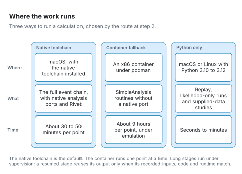

# Where the work runs

[Architecture](README.md) · [Reading the figures](README.md#reading-the-figures)

A calculation runs on one of three backends, chosen by the route at step 2.

<picture>
  <source media="(prefers-color-scheme: dark)" srcset="../figures/svg/dark/backends.svg">
  
</picture>

The native toolchain is the default. Before a native run, check the computer with the health check in [step 1](stage-1-environment.md). For portability notes, see [native portability](../reference/native-portability.md).
