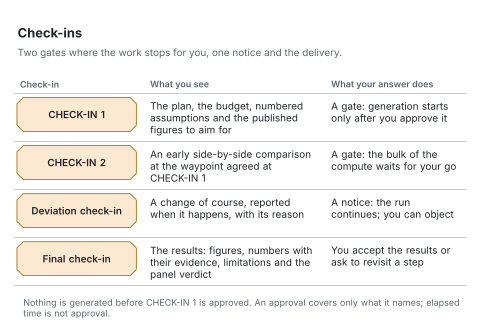

# Check-ins

[Architecture](README.md) · [Reading the figures](README.md#reading-the-figures)

A check-in is a message to you at a set point in the run. CHECK-IN 1 and CHECK-IN 2 are gates: heavy compute waits for your answer. A deviation check-in tells you about a change of course when it happens; the run continues and the change is recorded. The final check-in delivers the results for you to accept or send back.

<picture>
  <source media="(prefers-color-scheme: dark)" srcset="../figures/svg/dark/checkins.svg">
  
</picture>

| Check-in | What you see | What your answer does |
|---|---|---|
| CHECK-IN 1 | The plan, the budget, numbered assumptions and the published figures to aim for | A gate: generation starts only after you approve it |
| CHECK-IN 2 | An early side-by-side comparison at the waypoint agreed at CHECK-IN 1 | A gate: the bulk of the compute waits for your go |
| Deviation check-in | A change of course, reported when it happens, with its reason | A notice: the run continues; you can object |
| Final check-in | The results: figures, numbers with their evidence, limitations and the panel verdict | You accept the results or ask to revisit a step |

Approvals are recorded and bound to what you reviewed. An approval covers only what it names; elapsed time is not approval. The run's state shows which check-in is pending, so a resumed session continues from the right place.

The rules for writing each check-in are in [the check-in checklist](../workflow/checklists/check-ins.md).
