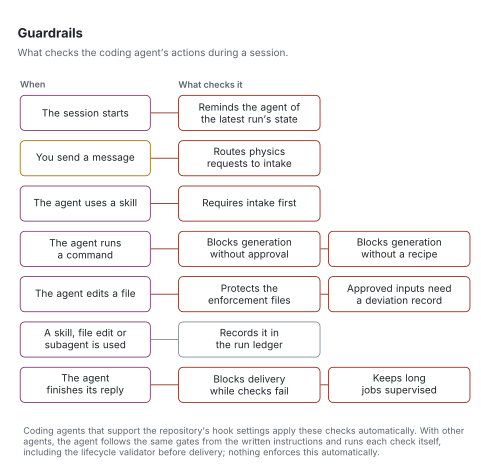

# Guardrails

[Architecture](README.md) · [Reading the figures](README.md#reading-the-figures)

Guardrails check what the coding agent does, at the moment it does it. Each row is an independent trigger, not a sequence.

<picture>
  <source media="(prefers-color-scheme: dark)" srcset="../figures/svg/dark/guardrails.svg">
  
</picture>

| When | What checks it |
|---|---|
| The session starts | Reminds the agent of the latest run's state |
| You send a message | Routes physics requests to intake |
| The agent uses a skill | Requires intake first |
| The agent runs a command | Blocks generation without approval; blocks generation without a recipe |
| The agent edits a file | Protects the enforcement files; approved inputs need a deviation record |
| A skill, file edit or subagent is used | Records it in the run ledger |
| The agent finishes its reply | Blocks delivery while checks fail; keeps long jobs supervised |

Coding agents that support the repository's hook settings apply these checks automatically. Other agents read AGENTS.md and the skills and follow the same gates from the written instructions; on those hosts the agent runs each check itself, including the lifecycle validator before delivery, and nothing enforces this automatically. Step 9 runs the verification panel in either case.

The gates, and the failures each one prevents, are listed in [the failure catalogue](../reference/failure-modes.md).
