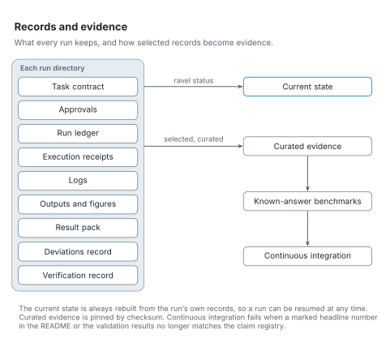

# Records and evidence

[Architecture](README.md) · [Reading the figures](README.md#reading-the-figures)

Every run keeps its own records, so it can be checked and resumed, and selected records become the evidence this repository ships.

<picture>
  <source media="(prefers-color-scheme: dark)" srcset="../figures/svg/dark/records.svg">
  
</picture>

`ravel status --rundir <run> --write` rebuilds the current state from the run's own records. Use it to resume a run; never start the run again.

Curated evidence is pinned by checksum. Continuous integration fails when a marked headline number in the README or the validation results no longer matches the claim registry. See [the run-directory layout](../workflow/run-directory.md) and [the evidence index](../validation/evidence.md).
