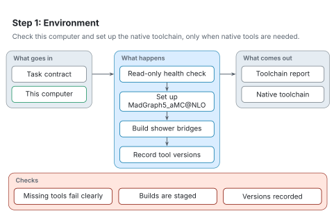

# Step 1: Environment

[Architecture](README.md) · [Agent procedure for this step](../workflow/steps/01-environment.md) · [Reading the figures](README.md#reading-the-figures)

Step 1 makes sure this computer can run the native HEP toolchain. It only matters when a calculation generates events; replay, likelihood-only runs and supplied-data studies skip it.

<picture>
  <source media="(prefers-color-scheme: dark)" srcset="../figures/svg/dark/stage-1-environment.svg">
  
</picture>

## What goes in

- The task contract, which says whether native tools are needed.
- This computer.

## What happens

1. A read-only health check reports what is installed and what is missing.
2. If needed, the native toolchain is set up: Miniforge, the MadGraph5_aMC@NLO environment and the analysis environments.
3. The small C++ bridges between Pythia 8, HepMC and the analysis code are built.
4. The versions of every tool are recorded.

## What comes out

- A toolchain report.
- A native toolchain ready for steps 3 and 4.

## Checks

- The health check fails clearly when a required tool is missing, instead of letting a later stage fail silently.
- Builds are staged: an existing working installation is kept until a new build succeeds.
- Tool versions are recorded with the run.

## When something goes wrong

- A tool run outside its environment can exit successfully while doing nothing. RAVEL runs every tool through its environment helper and checks for the expected output, not just the exit code.
- Native recipes are written for macOS 11 or later and are verified on Apple Silicon. On other systems, use the container fallback or the Python-only routes.
