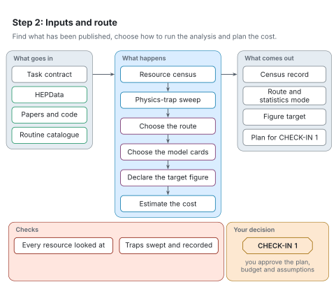

# Step 2: Inputs and route

[Architecture](README.md) · [Agent procedure for this step](../workflow/steps/02-inputs.md) · [Reading the figures](README.md#reading-the-figures)

Step 2 finds what has been published for the analysis, decides how to run it and prepares the plan you approve at CHECK-IN 1. Nothing is generated during this step.

<picture>
  <source media="(prefers-color-scheme: dark)" srcset="../figures/svg/dark/stage-2-inputs.svg">
  
</picture>

## What goes in

- The task contract.
- HEPData records: tables, likelihoods and efficiency maps.
- The paper, its source and any public analysis code.
- The routine catalogue (Rivet and SimpleAnalysis).

## What happens

1. A resource census looks through HEPData, the routine collections, the paper source, public code and later papers that cite the analysis.
2. A physics-trap sweep checks the request against known pitfalls, such as long-lived particles or a result that needs a shape fit.
3. The coding agent chooses the route: the analysis implementation, the detector treatment and the statistics mode.
4. The coding agent chooses and checks the model cards: the process, parameter and run-setting files that MadGraph5_aMC@NLO reads.
5. The coding agent declares the published figure to reproduce, with a waypoint: one piece of a published figure that can be reproduced cheaply and is shown to you side by side at CHECK-IN 2.
6. The cost is estimated from measured timings, and the run's ladder is set: a dry run with no events, a small smoke run, the full sample, then the scan.

## What comes out

- A census record of what exists online.
- The chosen route and statistics mode.
- The figure target.
- The plan for CHECK-IN 1.

## Checks

- Every resource the census finds is looked at before anything is declared unavailable.
- The trap sweep is recorded with the run.

## Your decision

CHECK-IN 1: you see the plan, the budget, numbered assumptions and the published figures to aim for. Nothing is generated until you approve. You can approve, answer any numbered assumption (unanswered ones proceed as proposed), ask questions, or change the plan, the figure or the scope.

## When something goes wrong

- An input that seems missing often exists in a HEPData resource, a later paper or public code. RAVEL runs the census before saying something is unavailable.
- When no analysis routine exists, the route says so and labels the result as sensitivity only.
