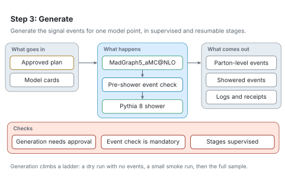

# Step 3: Generate

[Architecture](README.md) · [Agent procedure for this step](../workflow/steps/03-generate.md) · [Reading the figures](README.md#reading-the-figures)

Step 3 generates the signal events for one model point. It runs only within the scope you approved at CHECK-IN 1.

<picture>
  <source media="(prefers-color-scheme: dark)" srcset="../figures/svg/dark/stage-3-generate.svg">
  
</picture>

## What goes in

- The plan approved at CHECK-IN 1.
- The model cards (process, parameters, run settings).

## What happens

1. MadGraph5_aMC@NLO generates parton-level events.
2. The events are checked before the shower: masses, decay tables, weights and the event count.
3. Pythia 8 showers and hadronises the events.

Generation climbs a ladder: a dry run with no events, a small smoke run, then the full sample.

## What comes out

- Parton-level events.
- Showered events.
- Logs and execution receipts.

## Checks

- Generation is blocked unless an approval and a generation recipe exist.
- The pre-shower event check is mandatory.
- Every long stage runs under supervision and can be resumed.

## When something goes wrong

- A decay table that lists only total widths gives undecayed particles and empty signal regions while every tool exits successfully. The pre-shower check catches it.
- Generation can report success without writing events, or a later stage can read a file that is still being written. RAVEL checks that the events are complete before anything reads them.
