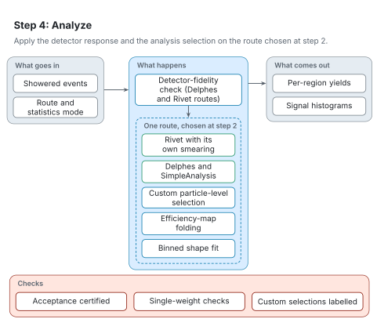

# Step 4: Analyze

[Architecture](README.md) · [Agent procedure for this step](../workflow/steps/04-analyze.md) · [Reading the figures](README.md#reading-the-figures)

Step 4 applies the detector response and the analysis selection, on the route chosen at step 2.

<picture>
  <source media="(prefers-color-scheme: dark)" srcset="../figures/svg/dark/stage-4-analyze.svg">
  
</picture>

## What goes in

- The showered events.
- The route and statistics mode from step 2.

## What happens

1. For the Delphes and Rivet routes, the detector-fidelity check runs first: the Rivet routine's smearing is verified, or the Delphes detector card is matched to the analysis.
2. Then exactly one route runs: a Rivet routine with its own detector smearing; Delphes followed by SimpleAnalysis (native ports by default, a container otherwise); a declared custom particle-level selection; efficiency-map folding; or a binned shape fit.

## What comes out

- Yields for each signal region.
- Signal histograms.

## Checks

- Acceptance times efficiency is certified per region against the published values before any limit is quoted.
- Routines that need single-weight input are run accordingly.
- A custom selection without a published routine is labelled as sensitivity only.

## When something goes wrong

- A selection can run cleanly yet disagree with the publication. RAVEL compares the acceptance region by region and records the cause of any difference before the yields are used.
