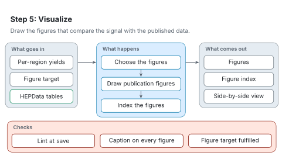

# Step 5: Visualize

[Architecture](README.md) · [Agent procedure for this step](../workflow/steps/05-visualize.md) · [Reading the figures](README.md#reading-the-figures)

Step 5 draws the figures that compare the signal with the published data.

<picture>
  <source media="(prefers-color-scheme: dark)" srcset="../figures/svg/dark/stage-5-visualize.svg">
  
</picture>

## What goes in

- The per-region yields.
- The figure target declared at step 2.
- HEPData tables.

## What happens

1. The figures are chosen from the analysis type, not by hand.
2. Publication figures are drawn.
3. The figures are indexed.

## What comes out

- Figures.
- A figure index.
- A side-by-side view of the published and the produced figure.

## Checks

- The lint rejects overlapping labels, hidden data and crowded ticks.
- Every figure shown to you has a caption.
- The declared figure target is fulfilled or reported as not.

## When something goes wrong

- A figure drawn from a caption rather than the published numbers, or on the wrong axis scale, can look right and be wrong. RAVEL draws from the HEPData tables and the figure contract, and shows the published figure beside its own.
