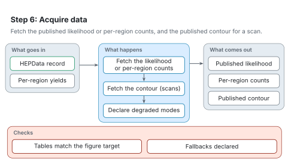

# Step 6: Acquire data

[Architecture](README.md) · [Agent procedure for this step](../workflow/steps/06-acquire-data.md) · [Reading the figures](README.md#reading-the-figures)

Step 6 fetches the published likelihood or per-region counts for step 7, and the published contour for a scan.

<picture>
  <source media="(prefers-color-scheme: dark)" srcset="../figures/svg/dark/stage-6-acquire-data.svg">
  
</picture>

## What goes in

- The analysis's HEPData record.
- The per-region yields from step 4.

## What happens

1. The published likelihood is downloaded when it exists; otherwise, per-region counts are built from the published reference data.
2. The published exclusion contour and limit grid are fetched for a scan.
3. Any fallback, such as digitised values, is declared as a degraded mode.

## What comes out

- The published background-only likelihood.
- Per-region counts.
- The published contour.

## Checks

- The tables used match the declared figure target.
- Every fallback is declared.

## When something goes wrong

- A HEPData record holds contours for several models. RAVEL picks the tables for your model and checks them against the figure target.
