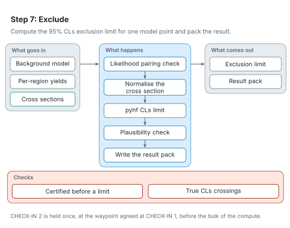

# Step 7: Exclude

[Architecture](README.md) · [Agent procedure for this step](../workflow/steps/07-exclude.md) · [Reading the figures](README.md#reading-the-figures)

Step 7 computes the 95% CLs exclusion limit for one model point and writes the result pack. RAVEL reports exclusion limits, never discovery claims.

<picture>
  <source media="(prefers-color-scheme: dark)" srcset="../figures/svg/dark/stage-7-exclude.svg">
  
</picture>

## What goes in

- The background model: the published likelihood or per-region counts.
- The per-region yields.
- Cross-section tables.

## What happens

1. The likelihood is checked against the selection that produced the yields.
2. The signal is normalised to the NLO+NLL cross section with a k-factor where a reference grid exists; otherwise the limit is quoted at leading order, with the k-factor range stated.
3. pyhf computes the 95% CLs limit, reaching the true crossing rather than a grid edge.
4. The limit is checked for plausibility.
5. The result pack is written.

## What comes out

- The exclusion limit, observed and expected.
- The result pack.

## Checks

- A limit is refused until acceptance is certified.
- Each crossing is bracketed and refined; a limit at a bound is reported as a bound.
- A plausibility verdict is recorded.

## CHECK-IN 2

CHECK-IN 2 is held once, at the waypoint agreed at CHECK-IN 1, before the bulk of the compute; see [Check-ins](checkins.md).

## When something goes wrong

- A fixed grid of signal strengths can stop short of the true limit, and an optimiser can report success at a poor fit. RAVEL brackets each crossing, refines it and checks the fit.
- Comparing cross sections on different bases gives wrong ratios. RAVEL normalises both sides the same way before comparing.
