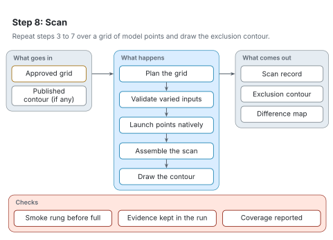

# Step 8: Scan

[Architecture](README.md) · [Agent procedure for this step](../workflow/steps/08-scan.md) · [Reading the figures](README.md#reading-the-figures)

Step 8 repeats steps 3 to 7 over a grid of model points and draws the exclusion contour, next to the published one when it exists. It is skipped for a single point.

<picture>
  <source media="(prefers-color-scheme: dark)" srcset="../figures/svg/dark/stage-8-scan.svg">
  
</picture>

## What goes in

- The grid approved at CHECK-IN 1.
- The published contour from step 6, if there is one.

## What happens

1. The grid is planned, one run per point.
2. The parameters that vary are validated before launch.
3. The points run on the native toolchain, in parallel where possible.
4. The finished points are assembled into one scan record.
5. The contour is drawn, over the published one when it exists, with a map of the differences.

## What comes out

- A scan record.
- The exclusion contour.
- A difference map.

## Checks

- A smoke rung runs before the full scan.
- Every point's evidence stays inside the run.
- Coverage is reported, including missing and failed points.

## When something goes wrong

- Long scans can run out of disk or lose points. The plan budgets the disk, each finished point's large files are removed, and RAVEL reports exactly which points are missing.
- A contour compared on the wrong cross-section basis moves. RAVEL rebases before comparing.
