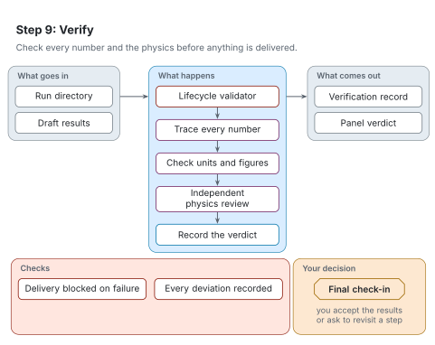

# Step 9: Verify

[Architecture](README.md) · [Agent procedure for this step](../workflow/steps/09-verify.md) · [Reading the figures](README.md#reading-the-figures)

Step 9 checks every number and the physics before anything is delivered. It is mandatory.

<picture>
  <source media="(prefers-color-scheme: dark)" srcset="../figures/svg/dark/stage-9-verify.svg">
  
</picture>

## What goes in

- The run directory.
- The draft results.

## What happens

1. The lifecycle validator checks that every required stage ran in order.
2. The agent traces every quoted number to the file it came from, with RAVEL's look-up checks.
3. The agent checks units and figures.
4. An independent reviewer, in a fresh context, checks the physics.
5. The panel records a verdict.

## What comes out

- A verification record.
- The panel verdict: pass, concerns or fail.

## Checks

- Delivery is blocked while the validator fails.
- Every change of course is in the deviations record.

## Your decision

Final check-in: you receive the results with their evidence, limitations and the panel verdict, and accept them or ask to revisit a step.

## When something goes wrong

- A number in the write-up can drift from the files. The panel does not pass until they agree.
- A failed verdict is never fixed silently: the fix is recorded and the panel runs again.
