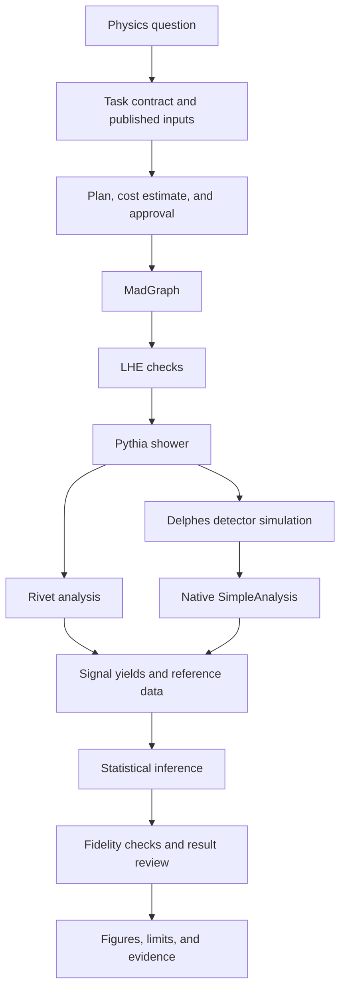

# Architecture

Ravel connects established HEP tools with workflow state, task validation,
provenance, and result checks. The Python command-line interface exposes a small
set of directly usable operations; the full simulation workflow additionally
requires the native toolchain and analysis-specific inputs.

## Execution paths

The analysis route depends on available published resources and the task contract;
the diagram shows the common simulation paths. Efficiency-map and scoped
shape-fit workflows have their own applicability requirements. Native execution
is the default; a container route remains a fallback for analyses that need it.
[Scope](../reference/scope.md) and [capabilities](../reference/capabilities.md)
define the operational boundaries.

`ravel replay` enters at the existing benchmark inputs and freshly runs the
statistical and provenance checks. Simulation and possibly acceptance are cached.
`ravel validate` checks the task-contract schema. `ravel audit` inspects a source
checkout's workflow documents and available evidence. These commands have
different meanings; see the [CLI reference](../cli.md).

## Implementation

| Location | Responsibility |
|---|---|
| `src/ravel/cli.py` | Public command parsing and execution |
| `src/ravel/physics/` | Statistical engines, physics adapters, and native analysis code |
| `src/ravel/workflow/` | Routing, workflow state, provenance, resource acquisition, and stage supervision |
| `src/ravel/validation/` | Contract, lifecycle, input, fidelity, and artifact checks |
| `src/ravel/plotting/` | Figure acquisition, overlays, manifests, and layout checks |
| `native/` | Native C++ bridges and shell launch/build helpers |
| `benchmarks/` | Registered cases, historical baselines, and prospective experiment accounting |
| `tests/` | Unit regressions and adversarial workflow cases |
| `scripts/` | Repository audits, publication checks, and maintenance entry points |

Upstream generators, detector tools, and inference libraries retain their own
implementations and licenses. Attribution is in
[third-party tools](../reference/third-party.md).

## Enforcement and evidence

Agent hooks check supported tool calls, and lifecycle validators inspect the
resulting run artifacts. Approval records bind to the reviewed contract, check-in,
and cost inputs so changing those inputs invalidates the recorded approval.
These mechanisms apply at their documented entry points; they are not an
operating-system sandbox for arbitrary shell commands.

The workflow stores stage status, input identities, seeds, and outputs with the
run. Verification distinguishes input/schema validity, execution success,
implementation parity, agreement with published physics, and the justification
for a scientific claim. One passing layer does not establish the others.

Publication checks compare declared numerical claims with their sources and
verify the required artifact checksums. Test cases exercise failure behavior,
including stale approvals, malformed inputs, missing evidence, and unsupported
state transitions. An independent scientific review remains necessary for results;
the research protocol separately asks whether these controls improve delegated
work in practice.

See [validation results](../validation/results.md),
[task contracts](../reference/task-contract.md), and
[research](../research/README.md) for those distinct forms of evidence.
