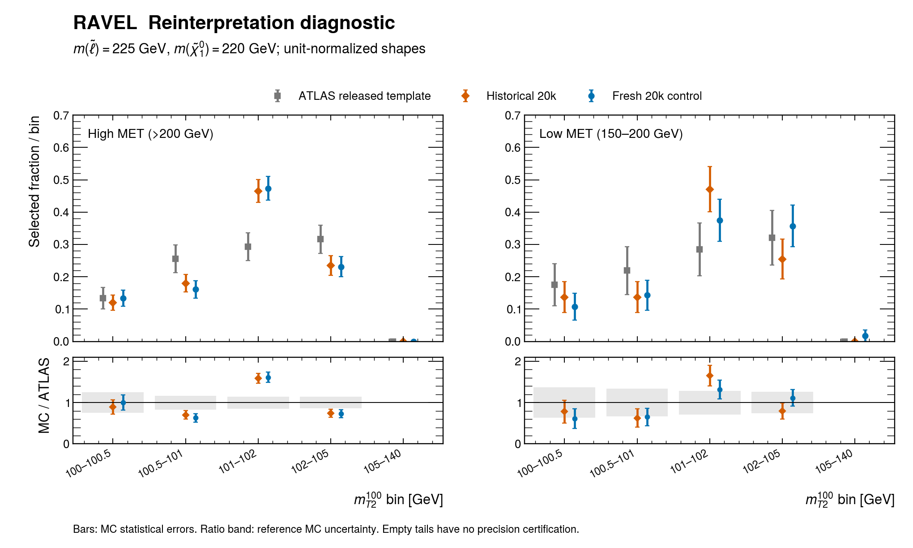
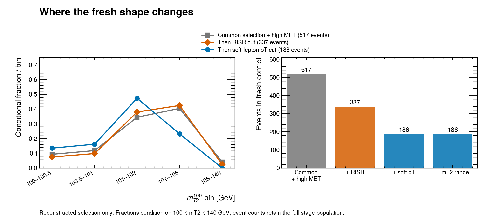

# The 225/220 GeV discrepancy recurs

The new control reproduces the problematic signal shape, rather than explaining
it away as a numerical or plotting artifact. A fresh 20,000-event sample puts
47.3% of selected high-MET events in the 101–102 GeV mT2 bin. The historical
sample gives 46.5%; the released ATLAS template gives 29.4%. The full RRR
reproduction remains unresolved.

## What was actually run

One 225/220 GeV control used the retained historical physical cards: six charged
slepton states, including staus, CTEQ6L1, one unmerged matrix-element jet,
`ptj=20 GeV`, `ptj1min=50 GeV`, 13 TeV collisions, 139 inverse femtobarns and one
factor of 1.18. Explicit MadGraph, shower and detector seeds were 2309, 83091 and
83093. The generator was MadGraph 2.9.27 and the shower was Pythia 8.312. The
historical TOML requested a different MadGraph version; the historical log,
rather than that request, establishes the version actually used.

The current public native adapter ran ten stages through signal yields and
all-event reconstructed diagnostics. All ten succeeded. There were no generation
retries, subagents or likelihood inversions. The run used one MadGraph worker and
one thread per numerical library. The native chain took 850 seconds (14.2 minutes).
The combined shower, compression and storage-validation stage took 527 seconds;
MadGraph took 105 seconds and Delphes 143 seconds. The shape analysis and
production-state census took approximately 0.65 and 1.96 seconds respectively.

The old sample's effective generator seed and exact historical detector-card
bytes are incompletely recoverable. This is therefore a current-code control
using the historical physical recipe, not a certified independent historical
replica. The samples are not pooled. Original events, cards, failed preparation
messages and intermediate files remain retained.

## The discriminating result

| Quantity | Historical 20k | Fresh 20k | ATLAS template |
|---|---:|---:|---:|
| High-MET selected events | 200 | 186 | Weighted template |
| Events in 101–102 GeV | 93 | 88 | Weighted template |
| Fraction in that bin | 46.5% | 47.3% | 29.4% |
| MC standard error of fraction | 3.5 percentage points | 3.7 percentage points | 4.3 percentage points |

The old/fresh two-sided Fisher comparison for this bin gives p=0.919. The fresh
versus ATLAS difference is 18.0 percentage points, or 3.19 combined MC standard
errors under the stated independent-bin moment approximation. This is not a
global discovery significance. The historical point was selected after observing
the scan; the fresh high-MET recurrence check was specified before generating
its events. Secondary flavor, low-MET and kinematic comparisons are descriptive.

These are unit-normalized distributions with their normalization-induced
covariance. Their discrepancy cannot be removed by a uniform luminosity,
cross-section or k-factor adjustment. No new absolute cross-section limit is
inferred from this comparison.

## Where the concentration grows

The fresh all-event trace accounts for 20,000 distinct reconstructed events.
The high-MET selection proceeds as follows:

| Retained selection | Events | Fraction in 101–102 GeV |
|---|---:|---:|
| Common cuts and MET >200 GeV | 517 | 34.4% |
| Then RISR requirement | 337 | 38.0% |
| Then subleading-lepton pT requirement | 186 | 47.3% |
| Then final mT2 range | 186 | 47.3% |

This identifies where the concentration increases in our sample. It does not
identify a wrong cut. The high/low MET, RISR and soft-pT formulas were checked
against the public SimpleAnalysis implementation at commit
`5a33033d788619bb1039a5b8116fdf43c46fc72a`. The mT2 helper uses the actual visible
masses and a 100 GeV invisible test mass, as Ravel does. The inspected definitions
match; weakening them to improve agreement would change the analysis.

The [ATLAS paper](https://arxiv.org/html/1911.12606v2) defines the compressed
selection. The [RRR paper](https://arxiv.org/html/2306.11055v2) explicitly separates
particle-level acceptance validation from tuning the detector's lepton response.
That separation is the appropriate next diagnostic, because correct cuts can
reveal incorrect input distributions.

## Two inexpensive explanations did not resolve it

The detector truth records, converted events and selected events were joined by
their exact event IDs. The production-state census includes mixed stau-1/stau-2
production, which the historical process permits. Only three of the 186 selected
high-MET events originate from staus. Removing them leaves 85/183 in the driving
bin, or 46.4%. Stau contamination does not explain this observed concentration.
This conditional removal is not a separately normalized four-state simulation.

The fresh ee fraction in the driving bin is 27/52=51.9%, and the μμ fraction is
61/134=45.5%. The corresponding ATLAS fractions are 34.4% and 26.2%. Every
nonnegative mixture of these two retained fresh shapes lies between 45.5% and
51.9% in that bin. Adjusting their relative normalizations cannot produce 29.4%.
Matching the ATLAS ee/μμ mixture would instead give 48.0%. A pT-dependent
response difference remains possible.

## What this changes about the next experiment

The isolated 225/220 residual should no longer be treated primarily as a request
for more events or another root inversion. The new sample closely repeats the
old shape under the current implementation. This strengthens the case for a
stable differential acceptance/response mismatch at this point, while leaving
its physical origin unresolved.

The next high-value control should use the retained sample to compare
particle-level and reconstructed distributions in the joint variables
`mT2`, subleading-lepton pT, RISR and recoil. Match the published truth-object and
acceptance definitions before comparing truth yields. Distinguish the 101–102
and 102–105 GeV bins and ee/μμ throughout. If the disagreement is already present
at truth level, test one supported ISR/shower or generation assumption. If it
appears mainly after reconstruction, test the independently documented lepton
response, overlap removal and MET treatment on the same events. A lack of
published differential truth evidence must remain an explicit limitation.

No detector efficiency, generation cut or statistical threshold was tuned here.
The lower-generation-cut dependence previously observed at 150/140 GeV remains
open. A single repaired point would not establish the full contour or remove a
systematic shift elsewhere in the plane.

## Durable workflow changes and review limits

The shared CHECK-IN gallery validator now preserves absolute and parent-relative
path prefixes. Previously it could reject a valid reference or accidentally
check a same-named file inside the run. Twelve focused checks passed, including
the wrong-file counterexample. The
[reproduction checklist](../workflow/checklists/reproduction-closure.md) now makes
the yields-only shape waypoint, legacy-seed limitations and retained-event
composition controls explicit for other reproductions.

The event ceiling was prospectively reduced from 1.26 million to 1.20 million
after a fresh retained-storage forecast fell below the unchanged 60 GiB floor.
This removes unused optional budget while preserving room for the 52 nominal
points and this control. The prior policy and all data remain retained; this
change does not authorize launching the remaining grid.

The review independently reaggregated the official patch, checked count/weight
moments and normalized covariance, reconciled the trace with the ROOT bins, and
reconciled all production-state counts through exact event IDs. Portable
arithmetic and corruption checks are available in the
[evidence bundle](../../evidence/audits/2026-09-08-rrr-shape-control/README.md).
This was an in-session adversarial review, not an independent physicist panel.
Trigger, truth matching, generator-filter and author predicates absent from the
reconstructed trace remain unavailable. Neither CI nor these checks certify
acceptance, coverage, detector fidelity or the full RRR reproduction.
