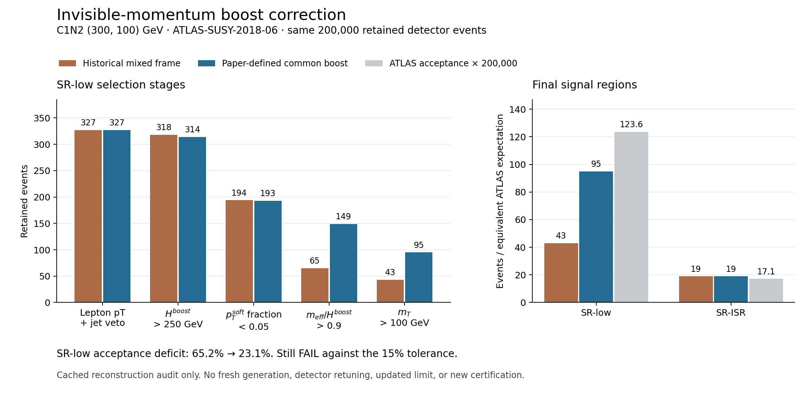

# Native reconstruction fidelity audit

Correcting one missing Lorentz boost raises SR-low from **43 to 95 events** on the same 200,000 retained C1N2(300,100 GeV) detector events. Its acceptance deficit falls from **65.2% to 23.1%**, which **still fails** the existing 15% tolerance. This is cached reconstruction reanalysis, with no fresh event generation, detector retuning, updated limit, or new acceptance certification.



The ATLAS paper defines `Hboost` by boosting both the three leptons and the reconstructed invisible four-vector into their common rest frame. The cached SimpleAnalysis reference at `5a33033d788619bb1039a5b8116fdf43c46fc72a` boosts only the leptons. The native port inherited that omission. Ravel now follows the paper's definition; historical parity with that reference is not a fidelity certificate for the corrected low-mass regions. The published analysis itself uses eRJR, so the previous explanation that this discrepancy arose from emulation versus an ATLAS full-RJR analysis is unsupported. [ATLAS, section 5](https://arxiv.org/pdf/1912.08479v2#page=9)

| Measurement | Historical expression | Paper definition | Published acceptance × efficiency |
|---|---:|---:|---:|
| SR-low accepted events | 43 | 95 | 123.61 equivalent events / 200,000 |
| SR-low acceptance × efficiency | 0.000215 | 0.000475 | 0.00061805 |
| SR-low ratio to reference | 0.3479 | 0.7685 | 1 |
| SR-ISR accepted events | 19 | 19 | 17.061 equivalent events / 200,000 |

The largest change appears at `meff/Hboost > 0.9`: 65 to 149 events survive that stage, followed by 43 to 95 after the transverse-mass cut. Fifty-two events enter SR-low and none leave it. CR-low changes from 50 to 65 and VR-low from 22 to 28. All ISR regions and the 1,055-event preselection are unchanged. The same-event differential isolates the reconstruction effect; it does not identify the origin of the remaining discrepancy. Reference values are retained in [reference.json](reference.json), including the original certification hash and the [ATLAS HEPData record](https://www.hepdata.net/record/ins1771533?version=2).

## Reproduce and inspect

The [differential JSON](erjr_differential.json) contains all 73 changed event IDs, old/new region membership and discriminating variables, every region count, the input SHA-256, and selection/core hashes. [The PDF](cutflow-comparison.pdf) is an exportable figure. No raw detector file is distributed; full replay requires the preserved `Delphes2SA.root` with SHA-256 `91c8ed8887601986f401971007a25754c38d3bf01d33c0bfa8456443ac09f8ac` from source run `CR005cert_c1n2_300_100`.

From a checkout, with NumPy and uproot available in the chosen Python environment:

```sh
python scripts/run.py ravel.physics.sa_routines.ewkthreeleptonerjr2018 \
  --input /path/to/retained/Delphes2SA.root --out /tmp/erjr-reanalysis.json
python evidence/audits/2026-09-05-native-fidelity/render.py \
  --audit /tmp/erjr-reanalysis.json --out /tmp/erjr-figures
```

The renderer uses Matplotlib from the replay environment. To render the distributed evidence alone, omit `--audit`. Installed environments can replace `python scripts/run.py` with `python -m`. The audit refuses an existing output path. Historical run reports, event files, reference routines, and certification artifacts remain unchanged.

Regression checks cover the invariant-mass identity for massless constituents, invariance under longitudinal boosts, and an actual retained event previously lost to the mixed-frame expression. The full 200,000-event replay agrees with an independently instrumented pre-edit differential on every region count and changed event ID. This validates the bounded algorithm correction, not the full simulation chain.

## Verification refresh — 2026-09-05

After the native driver's explicit routine/tool dispatch changes, the original **200,000-event** differential was rerun with the current source, and the current `native_simpleanalysis` driver independently processed the same retained ntuple. The differential JSON is **byte-identical** to the preserved original, including all region counts, cutflows, and all **73** changed-event records. The source event SHA-256 remains `91c8ed8887601986f401971007a25754c38d3bf01d33c0bfa8456443ac09f8ac`. The production driver reproduces every paper-definition region count, including **SR-low 95**, **SR-ISR 19**, and **preselection 1,055**. The native-fidelity unit tests pass **15/15**.

[The refreshed verification record](verification.json) records the commands, runtime versions, current source hashes, previous verification/source hashes, and output hashes. The differential replay used Python 3.14.5, NumPy 2.4.6, and uproot 5.7.4; unit tests used the locked Python 3.12 environment. Existing compressed/zero-lepton cached-output comparisons, the earlier direct weight read, and the figure inspection remain historical checks and were not repeated in this refresh. Original event files, differential data, references, figures, and certification records are unchanged. This refresh confirms current reconstruction/output consistency; the **23.1% SR-low acceptance deficit remains**, and no new physics certification or closure is claimed.

## Other failure mechanisms and limits

The [zero-lepton cutflows](zero_lepton_cutflow.json) retain input/reference hashes and reproduce the original squark and gluino counts. They compare the same benchmark masses against the rounded published cutflow, which is distinct from the higher-precision acceptance map used in certification. [ATLAS zero-lepton analysis](https://arxiv.org/abs/2010.14293)

| Conditional stage | Native retained events | Published cutflow |
|---|---:|---:|
| Squark 1200/600: common selection / all events | 66.38% | 73.92% |
| Squark SR2j-1600: MET/√HT cut / preceding stage | 63.62% | 68.10% |
| Squark SR2j-1600: meff cut / preceding stage | 61.15% | 67.30% |
| Gluino 2200/600: common selection / all events | 77.00% | 87.27% |
| Gluino SR4j-3400: meff cut / preceding stage | 30.17% | 41.01% |

The zero-lepton deficit accumulates across stages. No single transcription defect or detector cause was established for it. These ports implement discovery counting regions; the ATLAS multibin/BDT portfolio is a separate missing capability, so its best published limit is not a matched comparison to the discovery-only result.

The older compressed-slepton plane's 24.9% observed residual is also not explained by this three-lepton correction. A later independent scan reported 14.0%, but generation-tag settings, other configuration changes, and finite Monte Carlo statistics prevent causal attribution. Neither scan establishes a universal fast-simulation precision floor.

Saved detector events permit selection reruns and stage diagnostics. Retained Delphes files may support detector-object studies. Separating matrix-element/shower matching, parton densities, tagging phase space, and detector response requires controlled samples or rerunning the relevant upstream stage. A higher-statistics seed ensemble, a fixed-configuration A/B study, and acceptance recertification remain necessary before broader fidelity claims.

Separate native-engine safeguards now apply all declared signal `pt`, `eta`, and ID requirements, reject unsupported Delphes quality IDs, read actual nominal weights, and preserve raw counts plus signed `sumw` and `sumw2`. These fix latent hazards rather than explain the current benchmarks: all three certification ntuples have uniform positive weights. Signed-weight correctness here covers native selection/output; downstream statistical adapters require their own validation.
