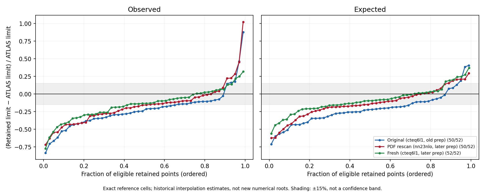
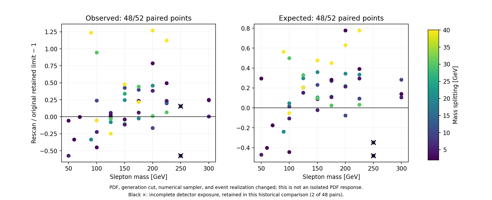

# Why the retained slepton comparison has a negative residual and red cells

This audit finds numerical and event-accounting defects in the retained campaigns, together with unresolved physics assumptions. The broad negative residual cannot yet be assigned to Delphes or the PDF. The red cell at `(m_slepton, Δm) = (50, 5) GeV` is particularly sensitive to a coarse numerical scan. A later retained campaign, using the original PDF, also gives substantially different limits. None of these historical campaigns constitutes a controlled isolation of a single effect.

No events were generated, no limits were refitted by this script, and no original scan, baseline, card, or log was changed. This directory preserves the historical numbers and exposes their limitations. The separate cached-workspace refit audit records direct evaluations of the likelihood; interpolation diagnostics here do not replace those evaluations.

## What the colors mean

The plotted quantity is `r = σ_UL,ours / σ_UL,ATLAS − 1`, comparing the same observed or expected column at an exact published mass-grid cell. A negative value means our quoted upper limit is smaller, hence more constraining. A red cell means our quoted upper limit is larger. It is not a measured event excess or a discovery significance.

A red cell can sit inside both exclusion contours without contradiction. At `(50,5)`, the original observed model strength is `μ95 = 0.0921897`, below the exclusion threshold of one. Its cross-section upper limit is nevertheless 87.84% above the ATLAS limit at that cell. The relative-comparison threshold is zero; the exclusion threshold is `μ95 = 1`. These answer different questions.

## The full retained population

Each campaign planned and recorded 52 points. Two original points have historical floor flags. Two PDF-rescan points have cap flags. The later cteq6l1 campaign has no such stored flags. A scalar without a stored flag is still a historical interpolation estimate, not a newly certified numerical root.

| Campaign | Observed eligible / planned | Observed signed median | Observed median absolute residual | Expected eligible / planned | Expected signed median | Expected median absolute residual |
|---|---:|---:|---:|---:|---:|---:|
| Original, cteq6l1, old native preparation | 50 / 52 | −22.72% | 24.92% | 50 / 52 | −22.06% | 24.07% |
| PDF rescan, nn23nlo, later preparation | 50 / 52 | −15.65% | 20.77% | 50 / 52 | −14.16% | 17.04% |
| Fresh campaign, cteq6l1, later preparation | 52 / 52 | −13.22% | 14.01% | 52 / 52 | −9.47% | 14.50% |

“Eligible” in this table reproduces the historical typed-reader comparison population. It does not imply complete detector exposure or a converged root. All planned points remain in [the CSV](points.csv) and [the full diagnostic JSON](diagnosis.json), including missing-quality comparisons. The four detector-exposure defects below are an additional, independently reported quality criterion.

There are 45 negative observed residuals among the original 50 comparisons and 44 negative expected residuals. The original observed residual spans −83.46% to +87.84%; its middle half spans −34.91% to −11.78%. The broad direction is real in the retained arithmetic, even though its cause and corrected magnitude remain unresolved.



## Confirmed numerical defects and unresolved precision

All 50 eligible observed values and all 50 expected medians in each of the first two scans reproduce plain linear interpolation between adjacent stored CLs samples. All 52 observed and expected medians in the fresh scan also reproduce this operation. A straight-line interpolation on a nonlinear CLs curve is not a root-convergence test.

At original `(50,5)`, the stored samples include:

| μ | Observed CLs |
|---:|---:|
| 0.001 | 1.0 |
| 0.1009 | 0.0003702174869257399 |

Linear interpolation gives the reported `μ95 = 0.0959401485031872`. The bracket width is 104.13% of that value. The stored artifact has no CLs evaluation at its claimed crossing. The expected median has the same problem. The original `(50,2)` and observed `(100,10)` also cross in their first broad interval. These are numerical diagnostic findings; a log interpolation is included only as a sensitivity probe and is not substituted for a fitted root.

For original observed curves with a monotonic sampled crossing, the median bracket width is 27.33% of the quoted limit. It is 18.14% for the PDF rescan and 20.28% for the fresh campaign. Wider geometric sampling in later runs reduced the extreme low-μ problem without making the historical procedure a converged root solver.

Four sampled curves also have material increases in CLs, using an absolute increase threshold of `1e-6`: original observed `(250,20)`, PDF-rescan observed `(225,30)`, fresh expected `(150,25.7)`, and fresh expected `(200,40)`. They have a single downward bracket but insufficient stored optimizer diagnostics to decide whether the increase comes from a numerical fit problem or another cause. The audit preserves their historical scalar, marks the sampled curve ambiguous, and does not sort the CLs values to conceal the increase. The four are not additional exclusions from the historical summary table.

The already known original `(60,5)` and `(70,5)` floor artifacts remain flagged. They are not used as measured limits. The source of a modern colored island therefore cannot be diagnosed merely by pointing to the two old floor flags: coarse, unflagged interpolation is a distinct failure mode.

## Confirmed incomplete detector exposure

Four PDF-rescan points have mutually corroborating analysis and SimpleAnalysis logs showing only about 1% of the requested detector sample was processed. Their Pythia logs report 20,000 written events. The cutflow `All` row still reports 20,000. These four are the only such mismatches among all 156 retained points inspected.

| PDF-rescan point | Detector events actually processed | Cutflow `All` count | Selected exclusive SR-S events | Stored limit disposition |
|---|---:|---:|---:|---|
| `(250,2)` | 233 | 20,000 | 0 | capped; already excluded from comparisons |
| `(250,5)` | 221 | 20,000 | 3 | ordinary historical scalar |
| `(250,10)` | 206 | 20,000 | 3 | ordinary historical scalar |
| `(250,20)` | 230 | 20,000 | 0 | capped; already excluded from comparisons |

For `(250,5)`, three signal-template bins each contain approximately 6.8525 expected events. Their normalization agrees with `σ × luminosity / 221`, not `σ × luminosity / 20000`. The cutflow acceptance uses the 20,000 denominator. Thus these artifacts disagree about effective exposure. The apparent 271.49 “20,000-event equivalents” in the patch are three actual selected events scaled with the smaller detector denominator. At `(250,10)` the analogous count is 291.26 equivalents from three events.

The `(250,5)` rescan residual is −71.91% observed and −62.34% expected. Its three selected events have a Poisson relative-count scale of about 58%, before model or detector uncertainty. The retained signal patches do not encode that finite-MC uncertainty. The four-second Delphes stage and approximately 200 processed events are consistent with a partial detector artifact, but the surviving logs do not establish the underlying truncation mechanism or whether missing events are random. Do not “repair” its physics result by mechanically multiplying by `20000 / N_processed`.

Excluding incomplete detector exposures is reported as a sensitivity check, not a rewritten baseline: the PDF-rescan comparison then contains 48/52 points, with median absolute residual 20.77% observed and 16.54% expected. Its comparison with the original contains 46 usable pairs out of 52 planned. An unchanged median does not make the two corrupted ordinary points acceptable.

Two other rescan points, `(200,10)` and `(225,10)`, have surviving generation logs without a final cross-section line following retries. Their scan field `sigma_ref_fb_lo` uses an analysis-log value that already included `k=1.18` and multiplies it again. That is a historical metadata inconsistency. The final inclusive-basis upper limit does not depend on that particular stored tagged-cross-section field, so this fact alone does not explain the final residual. The extracted values and hashes are retained rather than silently repaired.

## The rescan does not isolate the PDF

The historical rescan report says the same seeds “isolate the PDF term.” The retained evidence does not support that causal interpretation:

- The old native preparation ignored `ptj1min=50` in the TOML; the July 6 CR-002 fix began applying it. The registry explicitly associates the rescan with this correction. At 200 GeV the original tagged LO cross section is 42.71 fb, while the rescan records about 20.04 fb. The earlier measured fixed-PDF cut comparison was 42.83 versus 19.99 fb. This is evidence for a concurrent generation-cut change, not a measurement of its separate limit effect.
- Both archived TOMLs name `ptj1min=50`, but neither of the first two campaigns retains its effective run card. The original TOML therefore does not prove what was executed. The fresh campaign retains all 52 effective cards and they specify cteq6l1 and the 50 GeV leading-jet cut.
- The numerical sampler changed between the original and rescan; the low-μ interpolation defects therefore differ.
- A shared configured seed or seed offset does not establish identical generated events under a changed process integration and PDF. There is no retained event-pairing or reweighting construction that would support a paired common-random-number error cancellation.
- Four detector samples are incomplete, as shown above.

Across the 48 pairs allowed by the original stored limit flags, the median rescan/original change is **+6.47% observed and +17.85% expected**. The median absolute point-to-point change is **23.67% and 23.50%**. The observed central 80% ranges from −27.39% to +58.34%; the median shift is not an uncertainty estimate. After excluding incomplete detector exposures, 46 pairs remain and the expected median shift becomes +20.43%.



The later cteq6l1 campaign improves the median absolute residual to approximately 14% without changing the original PDF. Its own archived report correctly calls the attribution “PLAUSIBLE-UNATTRIBUTED.” This supports reopening the original “PDF is minor” and “remaining difference is fast simulation” conclusions. It does not prove the opposite causal claims.

## Normalization: what cancels and what remains an assumption

The stored sequence is `μ_raw → μ_raw × 1.18/k → μ_raw × (1.18/k) × (σ_incl4,LO × k_rounded / σ_model)`. The final cross-section limit multiplies by `σ_model`. Therefore:

`σ_UL = μ_raw × 1.18 × σ_incl4,LO × k_rounded/k`.

The single-selectron-left k factor and the chosen theory model cross section cancel from the final cross-section upper-limit comparison except for k rounding. The maximum fractional residual of this cancellation is `3.35497e-5`, or 0.00336%, across the three retained scans. A chirality-dependent k-factor critique by itself therefore cannot explain a 20–30% residual in these final rebased numbers. It can matter for a physical model normalization or exclusion contour under a different construction.

The assumptions that survive are the conversion from the generated, ISR-tagged six-state sample to an inclusive four-state acceptance, negligible selected stau contamination, and adequate coverage of accepted events by the generation cut. The PDF rescan continues to use the **cteq6l1 inclusive-four-state LO denominator** despite generating its tagged sample with nn23nlo. This is not a fully matched PDF-basis comparison. No independent same-PDF, same-cut inclusive reference for the rescan is established by the retained scan metadata.

The original report's categorical statements that normalization is “RESOLVED” and the remainder is necessarily a detector effect are therefore too strong. The dimensions and rescaling arithmetic can be audited; the physical acceptance conversion still requires evidence.

## Finite MC and the limits of the acceptance waypoint

Every retained signal patch in all three campaigns contains only a `mu_SIG` normfactor for the signal. None adds a signal `staterror` or `shapesys` modifier. The published background likelihood still has its own nuisance parameters; this observation concerns the added signal templates. Expected-limit bands are not an estimate of uncertainty from the finite generated signal sample.

The 20,000 requested events do not imply 20,000 informative signal events. The median number in the exclusive SR-S selection is 50.5, 77.5, and 88.5 for the original, rescan, and fresh campaigns respectively. Numerous likelihood bins contain fewer than ten selected events or no events. Aggregated event counts alone cannot establish the shape uncertainty or its correlation across bins.

At `(150,20)`, selected SR-S counts are 75, 130, and 142. Their approximate relative Poisson count scales are 11.55%, 8.77%, and 8.39%. The fresh inclusive-four-state acceptance comparison reports a +3.37% deviation in the combined SR-S acceptance, but that same point's cross-section limits deviate by −28.47% observed and −15.63% expected. The high and low components sum to the combined SR: these are not three independent closure tests. One inclusive acceptance waypoint cannot validate the differential mT2 spectrum, all 32 likelihood signal bins, the full mass plane, or the entire statistical construction. The old certificate also assumes that the generation cut loses no otherwise-accepted events.

## Tests that can resolve the remaining causes

1. Refit cached patches at the red cells, representative negative cells, contour-boundary cells, and quality failures with guarded optimizer checks and actual CLs evaluations at every reported crossing. Record all six observed/expected curve statuses and brackets. Agreement between independent backends is a control; it does not validate the signal model. Keep the archived campaign unchanged and publish corrected statistical results separately.
2. Enforce the generation → shower → detector → analysis event/weight ledger. An incomplete detector sample must be explicitly partial and ineligible for an ordinary full-run result. Require a positive full-exposure control and a deliberately truncated-file rejection. A zero-exit process and an existing ROOT file are insufficient.
3. Add and validate a finite-signal-MC treatment, including sparse and empty bins, using the available event-weight sums and the relevant likelihood prescription. Compare expected limits with and without that treatment as a labeled study. Do not invent a detector/PDF covariance or treat the five expected quantiles as MC uncertainty.
4. Audit the tagged-six-state → inclusive-four-state acceptance at multiple published nodes and by exclusive signal region, including flavour/chirality and stau contributions. Pin matched PDF/order conventions and establish whether the ISR generation cut removes accepted events. A single aggregate acceptance agreement cannot answer these questions.
5. Only after those deterministic defects are closed, design a controlled PDF/cut study with an explicit common setup, numerical procedure, uncertainty model, and sufficient independent event realizations. Test PDF, leading-jet cut, and detector settings separately. Do not tune the detector to whiten the same cells used for validation; reserve independent anchor points.

These are proposed falsifiable controls, not claims that all were run here. They do not require declaring statistical or scientific superiority over another tool.

## Artifacts, provenance, and rerunning

- [diagnose.py](diagnose.py): capture and replay implementation; defaults to the retained snapshot.
- [retained-inputs.json](retained-inputs.json): extracted scientific inputs, 156 per-point CLs curves, signal templates, selection counts, configuration fields, relevant log facts, and SHA-256/size records for 1,633 source files. It is a forensic extraction, not a replacement event sample.
- [diagnosis.json](diagnosis.json): 312 observed/expected point records, signed distributions, sampling brackets, normalization identities, exposure flags, and paired comparisons with full denominators.
- [points.csv](points.csv): compact pointwise table.
- [provenance.json](provenance.json): script, snapshot, and generated-output hashes, Python version, and source revision at capture.
- [verification.json](verification.json): final output checks, 1,627 unchanged archived/reference inputs, independent replay, and focused-test result. The complete snapshot uses compact JSON (3.17 MB) to stay within the distribution limit.
- [test_diagnose.py](test_diagnose.py): analytic exponential-curve counterexample, missing/bounded/nonmonotonic controls, signed outlier handling, full-population accounting, tampered residual rejection, and the real partial-exposure counterexample. Twelve focused tests pass.

The source revision at capture is `ce2338575f66b17b6ec63f1042412d39279f3cb8`; individual source hashes identify the exact captured bytes. Original scan identities are `sleptonscan_fig3_SCAN`, `CR004rescan_SCAN`, and `2026-08-28_SUSY-2018-16_slepton-fig3-fresh/fig3_SCAN`. The first two scans are also available as the public [original scan](../../scans/slepton-bino-figure-3/scan.json) and [PDF rescan](../../scans/slepton-bino-pdf-rescan/scan.json). The third campaign's extracted data are included here because its full development archive is not shipped.

The final renderer refresh changed exactly the `scan_contour.py` source fingerprint in the extracted snapshot. All archived input fingerprints, scientific snapshot fields, diagnostic JSON/CSV values, and diagnostic PNG bytes remained unchanged. The old and new renderer hashes are recorded in `verification.json`; the current snapshot hash is recorded in both verification and provenance.

The reference is the unmodified cached [ATLAS Figure 44ab table](../2026-09-05-scan-fidelity/atlas-limit-grid.yaml), [HEPData record 91374, version 5, table 91](https://doi.org/10.17182/hepdata.91374.v5/t91). Exact mass-node matching uses the appropriate observed or expected column and fb units. This diagnostic does not draw a published contour and is unaffected by the separate observed/expected-contour overlay repair.

With the repository's replay dependencies installed, run from either checkout:

```bash
python evidence/audits/2026-09-05-rrr-diagnosis/diagnose.py --out NEW_AUDIT_DIRECTORY
python -m pytest evidence/audits/2026-09-05-rrr-diagnosis/test_diagnose.py -q
```

The output directory must not exist. Replaying the frozen snapshot recomputes the report and figures without the private point directories or native toolchain. `--capture --root PATH` is a development-only operation that requires the original retained point files and cached likelihood. It reads them and writes a new extraction; it does not alter them. Run pytest from outside the development repository if an ignored local `py.py` shadows pytest's dependency.
