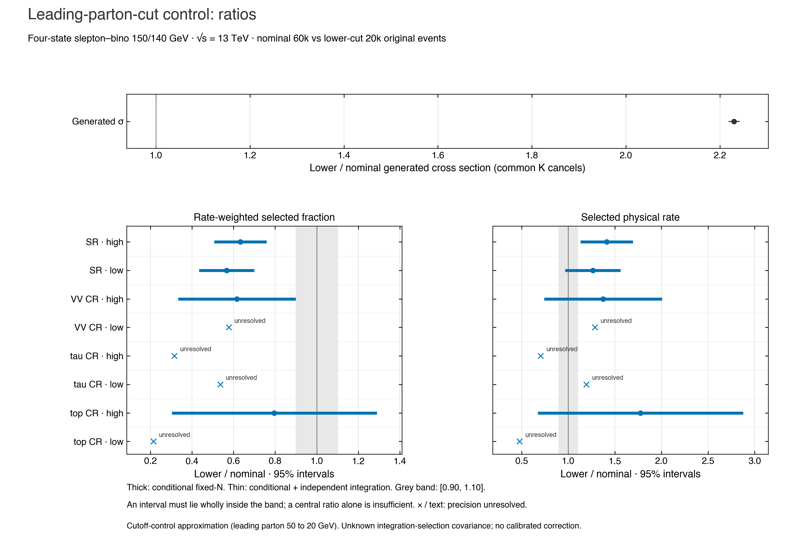
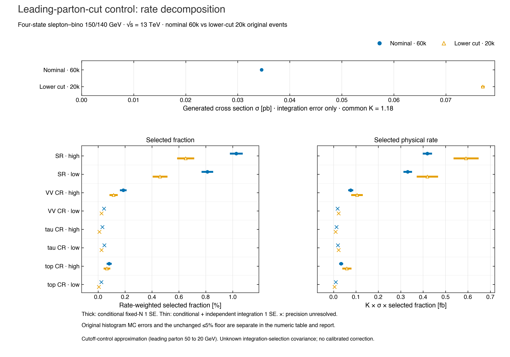

# RRR one-point cut dependence and likelihood controls

These completed 150/140 GeV results show numerical agreement at one mass point alongside substantial sensitivity to the leading-parton generation cut. They do not establish acceptance calibration, statistical coverage or a reproduced contour.

The nominal 50 GeV leading-parton cut matches the pinned RRR template. The 20 GeV control tests the robustness of that approximation. It does not demonstrate an incorrect implementation of the authors’ recipe or establish the lower cut as a calibrated replacement.

| Native sample | Original events | Observed limit (fb) | Median expected (fb) | Observed residual | Median residual |
|---|---:|---:|---:|---:|---:|
| nominal_20k | 20,000 | 48.8255 | 54.6857 | +4.702% | -3.256% |
| nominal_40k | 40,000 | 46.3666 | 57.9133 | -0.571% | +2.454% |
| pooled_60k | 60,000 | 47.3717 | 57.2736 | +1.584% | +1.323% |
| lower_20k | 20,000 | 35.8052 | 39.7839 | -23.219% | -29.618% |

The quoted reference is 46.633 fb observed and 56.526 fb median expected. All 24 native μ values, statuses and converted values are in [the CSV](tables/native-limits.csv) and [the evidence JSON](data/evidence.json). The three independent event streams contain 80,000 original events; the 60,000-event pool reuses the nominal parents and adds no events or independent mass point.

Displayed native limits use μ × 1.18 × 0.1350625 pb × 1000. The four-state inclusive LO control has a reported integration error of 0.0003703 pb. K=1.18 is a declared common operand. No independent uncertainty for K is invented; the inclusive integration uncertainty is shared by the four rows. Expected bands are likelihood quantiles, not simulation-error bars. Native and official μ refer to different nominal signal templates and are not directly interchangeable.

## Measured cut dependence

The lower cut increases the generated one-parton rate by a factor 2.22978, while reducing the rate-weighted selected fraction. The resulting high-region selected-rate ratio is 1.41171 with conditional-plus-integration 95% interval [1.14552, 1.67790]; the low-region ratio is 1.26369 with [0.98279, 1.54458]. Neither establishes the predeclared ±10% equivalence criterion. Across all 40 categories, 13 selected-rate comparisons are not established and 27 are precision-unresolved.





[Ratio PDF](figures/lower-ratios.pdf) · [Decomposition PDF](figures/lower-decomposition.pdf) · [All 38 model channels and two high/low aggregates](tables/lower-rates.csv)

The figures show the two primary SR aggregates and six individual CRs. Intervals use independent-stream fixed-N delta-method sampling variance; the broader intervals additionally assume independent generator integrations and independence from selected fractions. That covariance is not supplied. Gaussian intervals require at least ten selected and ten unselected events in every contributing stream. Sparse and zero cells keep unresolved intervals. The retained-histogram 5% precision floor is a separate Poissonized sumw2 diagnostic. No familywise or coverage claim follows from these per-category intervals.

## Matched official-model nuisance controls

All three arms retain the same supplied nominal signal, signal in six CRs, background content and observed data. Full retains the supplied signal modifiers; signal-MC-only retains normfactor plus staterror/shapesys; nominal-only retains normfactor. These are dimensionless same-model interventions, with 196/191/191 fitted parameters.

| Quantile | Full μ | Signal MC only μ | Nominal only μ | MC only / full | Nominal only / full |
|---|---:|---:|---:|---:|---:|
| observed | 0.26731086 | 0.25494455 | 0.25031005 | 0.953738 | 0.936401 |
| expected_minus2 | 0.16543567 | 0.16237848 | 0.16212978 | 0.981520 | 0.980017 |
| expected_minus1 | 0.22647319 | 0.21929222 | 0.21849889 | 0.968292 | 0.964789 |
| expected_median | 0.32649350 | 0.30730721 | 0.30522238 | 0.941235 | 0.934850 |
| expected_plus1 | 0.48492469 | 0.43360425 | 0.42875060 | 0.894168 | 0.884159 |
| expected_plus2 | 0.71284810 | 0.59152043 | 0.58192523 | 0.829799 | 0.816338 |

[All 18 roots and ratios](tables/official-limits.csv). Removing all supplied signal nuisance modifiers changes observed/median μ by −6.35994%/−6.51502%, and the +2 expected band by −18.36617%. Equal parameter counts do not make the two reduced models equivalent: removing a signal staterror contribution can change a shared constraint. These effects are not a global correction and are not transferred to native signal nuisances.

## Numerical evidence and retained failures

All seven fits report six resolved roots and 16 final fresh evaluations each. Native result files retain root/scan CLs values and a profile-consistency summary, but not the complete final evaluation records or conditional parameter vectors. The official controls also retain their 48 final root/bound evaluation records. The verifier checks the evidence actually present; this is not an independent optimizer or global-minimum proof.

The first pooled fit reached its 3600-second cap, encountered a cleanup exception, and was finalized failed with exit 124 after later quiescence was observed. Its elapsed time is unknown and no exclusion result is accepted. Neither successful SIGKILL nor the exact earlier process state is inferred. A new complete four-stage derivative produced the accepted pool. Lower-reader v1 failed on its metadata pin schema; v2 failed on stale derivative artifact custody. Both failures remain source-bound and were replaced by the completed v3 reader. These selected failures and retained optimizer diagnostic counts are not an exhaustive campaign-warning inventory.

## Verify or reproduce the projection

From this directory, with Python 3.10 or later and no installed Ravel package:

```sh
python -B verify.py
```

This offline standard-library check validates the exact bundle inventory, finite arithmetic, all six quantiles, pool lineage, sparse missingness, 120 ratio/interval calculations, CSVs and copied figure hashes. It does not read raw events or fit a model.

With the retained source workspace, an additional read-only check validates the selected original hashes and rebuilds the projections in memory:

```sh
python -B verify.py --source-root /path/to/source-checkout
```

The [source map](source-map.json) uses repository-relative original paths. It identifies selected small records, not an exhaustive raw-event custody replay. Private environment values, operator process/session identities, authorization quotes and raw LHE/HepMC/ROOT products are not shipped. Original receipt and plan hashes are commitments to originals; an offline reader cannot reconstruct or independently authenticate the complete unshipped receipts. Projected JSON is not byte-identical to the originals. The four figures are byte-identical copies; deterministic CSVs and JSON are projections. A hash manifest detects drift relative to this revision, not a coherent rewrite of the bundle and verifier together.

The producer source/runtime commitments distinguish native v4/v5 execution from the current public source. Later fixes are not attributed retrospectively to pinned binaries. The existing [earlier waypoint](../2026-09-06-rrr-waypoint/README.md) remains unchanged.

Primary references: [RRR, arXiv:2306.11055v2](https://arxiv.org/abs/2306.11055v2) and [ATLAS, arXiv:1911.12606](https://arxiv.org/abs/1911.12606). The exact published point and supplied-model identities are retained in the evidence and source map.

Cut robustness, detector/acceptance calibration, missing native detector/theory systematics, merging-scale behavior and statistical coverage remain open. This bundle contains one mass point and no new contour. Passing software CI does not establish those physics claims.
