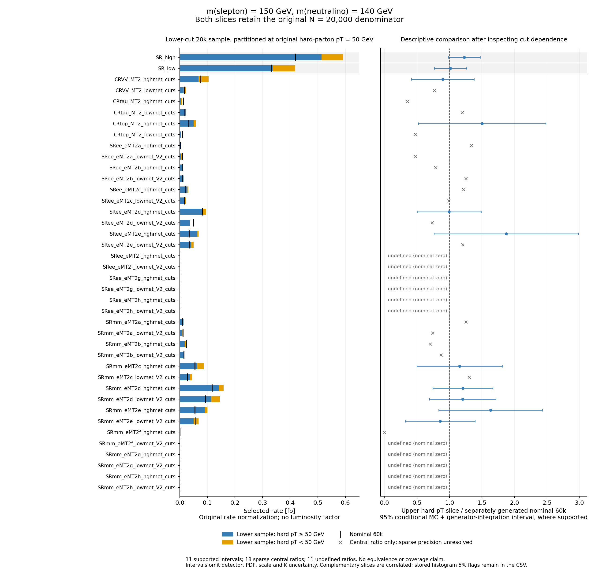

# RRR event identity, hard-parton partition and fresh 100/98 result

The completed controls identify two distinct limitations. At 150/140 GeV, events
below the nominal hard-parton cut explain much of the low-region rate increase.
At 100/98 GeV, the fresh pipeline still produces limits below the released
reference, with too few selected events for a precise low-region prediction.
Neither result is a reproduced mass-plane contour or detector calibration.

## Fresh 100/98 GeV result

All twelve native stages completed on 20,000 newly generated four-state
selectron/smuon events. A separate 1,000-event inclusive control at the same
masses and on the same declared process/PDF basis supplies the normalization.
Its LO rate is 0.574784 ± 0.001589 pb, where the error is the reported generator
integration error. K=1.18 is applied once. The conversion is
`sigma95 [fb] = mu95 × 0.574784 [pb] × 1.18 × 1000`.

| Quantity | Fresh native limit | Released reference | Relative difference |
|---|---:|---:|---:|
| Observed | 210.0049 fb | 238.13 fb | −11.8108% |
| Median expected | 169.0945 fb | 203.96 fb | −17.0943% |

[All six limits](tables/fresh10098-limits.csv) include both outer expected bands.
The reference row supplies only observed and median expected central values.
No uncertainty or outer-band residual is invented. The inclusive integration
error is a shared scale uncertainty evaluated at fixed mu; it is not an extra
likelihood nuisance, a PDF/theory error, or an uncertainty on the reference.

The high/low signal regions contain 59/11 selected events, with retained-histogram
MC errors of 13.02%/30.15%. All 38 model channels remain in the result: 16 have
nonzero signal and independent native signal `shapesys` constraints, while 22
zero-selected channels have unresolved precision. Zero selected events do not
establish zero acceptance. These errors are already represented by the implemented
per-bin MC model where supported; no second error is added to the reported limits.
The campaign's formal 5% primary precision checkpoint is at 150/140 GeV. Applying
that number here is an analogous diagnostic, not a newly invented preregistration.

The fit reports six resolved roots and 16 fresh numerical checks; its largest
recorded CLs discrepancy is 4.03×10⁻⁶. This bundle checks their scalar projection,
not an independent optimization or coverage calculation. The historical 100/98
template had different production content, signal shape, control-region signal
and MC-constraint construction. Its missing effective cards and raw events
prevent interpreting the old-to-fresh change as a controlled physics correction.

## Exact original-event identity

The lower-cut 150/140 sample was showered again with an observational wrapper
that records Pythia's original LHA object. The two complete decoded HepMC streams
contain 4,510,402,635 identical bytes, including all 20,000 event numbers. Every
original LHE event has a unique exact full-content match to its captured original
LHA record. No new hard events were generated by the replay.

This was necessary because shower evolution can change the apparent hard-particle
representation, including legitimate mass and recoil adjustments. Earlier
readers rejected real events. Their failed records remain preserved; the repair
did not introduce a momentum tolerance or fall back to row order as identity.
Original content is checked before ordinal and serialized event-number agreement.

The replay establishes identity for this retained sample and wrapper. A later
production integration is separate software and requires its own compiled
binary, plan and successful execution. It cannot inherit this sample's byte
equality result. The public bundle contains selected proof summaries and source
commitments; it cannot independently replay the unshipped event files or rebuild
the complete compiler/library/execution custody.

## Where the lower-cut events contribute

The 20,000-event sample generated with a 20 GeV leading-parton cut contains
10,954 events below 50 GeV and 9,046 at or above 50 GeV. Both complementary
contributions keep the original denominator of 20,000. Renormalizing the upper
slice by 9,046 would produce a different, incorrect estimate for this comparison.

| Region | Selected below 50 GeV | Selected at least 50 GeV | Upper-slice / nominal 60k rate | Conditional MC + integration 95% interval |
|---|---:|---:|---:|---:|
| High-MET SR union | 17 | 113 | 1.22710 | [0.98168, 1.47252] |
| Low-MET SR union | 18 | 74 | 1.01644 | [0.76837, 1.26452] |

Below-cut events account for about 13%/20% of the lower sample's selected high/low
rates. The upper low-region contribution is close to the separate nominal
central estimate. The upper high-region excess remains statistically unresolved.
Neither interval establishes ±10% equivalence. The partition was chosen after
observing cut dependence and is reported as a descriptive diagnostic.



[Vector PDF](figures/hard-slice-comparison.pdf) ·
[All 40 categories, missingness and covariance](tables/hard-slice-rates.csv)

The black marks show the independent 20k+40k nominal pool. It reuses its parents;
it is not a third independent replica. The bars show complementary selected-rate
contributions in fb, without luminosity. Eleven categories have supported
diagnostic intervals, eighteen retain sparse central ratios and eleven have
undefined ratios because the nominal denominator is zero. All appear in the
figure and CSV. The complete 147 native-region moment partitions are also
retained in [the evidence JSON](data/evidence.json).

Fixed-N sampling variance and Poissonized histogram sumw2 are kept separate.
Complementary slices have negative covariance; including it recovers the full
sample's fixed-N variance. Ratio intervals assume independent streams and
independent generator integration errors, also independent of selected fractions.
Those covariances are not supplied. Gaussian intervals require at least ten
selected and ten unselected events in every contributing stream. This safeguard
does not establish coverage. Detector, PDF, scale and K uncertainties are omitted.

The nominal 50 GeV cut matches the pinned RRR unmerged prescription. The diagnostic
does not establish a transcription error or validate a lower-cut replacement.
Missing higher jet multiplicities, shower/PDF dependence and detector response
remain separate possible causes. No cut was chosen to improve agreement with
the observed reference limit.

## Verify the public projection

From this directory, using Python 3.10 or later without Ravel installed:

```sh
python -B verify.py
```

This checks exact bundle bytes, six conversions and residuals, all 38 fresh
channels, all 147 complementary moment partitions, 40 rate/ratio calculations,
conditional intervals and CSV values. The figure files are exact copies of the
independently reviewed originals. The final PNG and rendered PDF were inspected.
It does not fit a model, traverse raw events or independently validate detector
selections. Replay hashes commit to a reported complete traversal; this public
check does not perform that traversal again.

With the original source workspace, also check the five selected input records
and the three byte-identical copied artifacts, then reconstruct the projection:

```sh
python -B verify.py --source-root /path/to/source-checkout
```

The [source map](source-map.json) uses repository-relative paths. An explicitly
requested source check fails if any selected original is missing or changed.
It still does not reconstruct the full private receipt chain. The manifest
detects drift against this revision, not a coherent rewrite of all evidence and
verification code together. Software CI and these checks do not certify the
physics, scientific autonomy, statistical coverage or the remaining mass plane.

Primary references: [RRR, arXiv:2306.11055v2](https://arxiv.org/abs/2306.11055v2)
and [ATLAS, arXiv:1911.12606](https://arxiv.org/abs/1911.12606).
