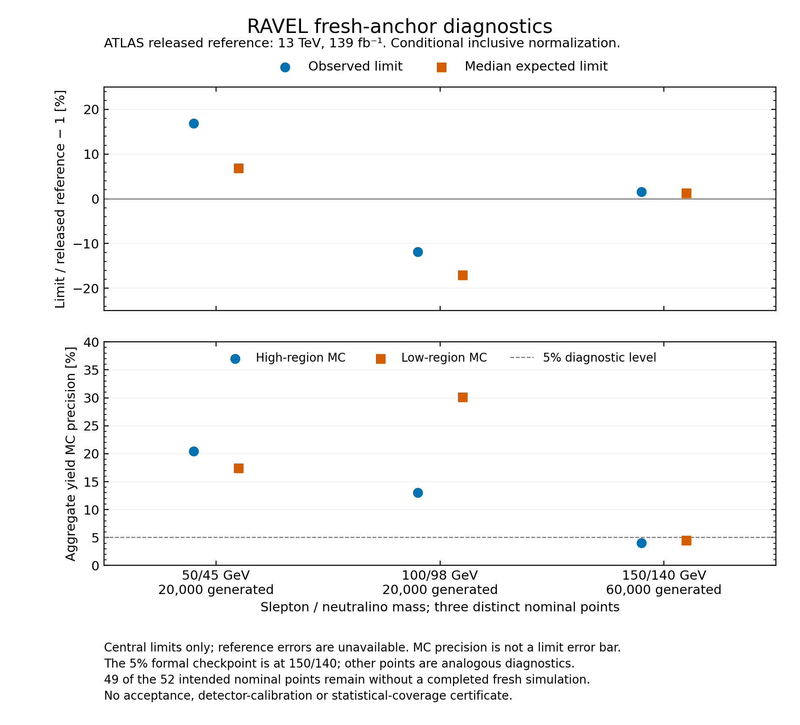

# Three fresh RRR anchors: limits, MC precision and reconstructed fractions

Three completed four-state selectron/smuon anchors show different discrepancy
signs. At 150/140 GeV, the original-exposure 20k+40k pool gives central limits
within about 1.6% of the released reference. The fresh 50/45 limits are higher,
and the fresh 100/98 limits are lower. Both 20k low-mass samples have sparse
selected populations. These observations do not establish reproduction of the
52-point plane or a detector correction.

| Parent/LSP, GeV | Original generated exposure | Observed limit, fb | Reference, fb | Difference | Median expected limit, fb | Reference, fb | Difference |
|---|---:|---:|---:|---:|---:|---:|---:|
| 50/45 | 20,000 | 615.6280 | 526.920 | +16.8352% | 755.3404 | 707.140 | +6.8162% |
| 100/98 | 20,000 | 210.0049 | 238.130 | −11.8108% | 169.0945 | 203.960 | −17.0943% |
| 150/140 | 60,000, from 20k+40k | 47.3717 | 46.633 | +1.5842% | 57.2736 | 56.526 | +1.3226% |

[All 18 limits](tables/limits.csv) retain the unchanged dimensionless μ and all
five expected quantiles, including both outer bands. Each fit reports six
resolved roots and 16 fresh numerical checks, for 48 reported checks. Maximum
recorded CLs discrepancies are 5.71×10⁻⁶, 4.03×10⁻⁶ and 3.98×10⁻⁶ respectively.
This is recorded numerical consistency, not a new independent optimization,
coverage study or proof of a global optimum. No fit was rerun for this bundle.

## Each mass point keeps its own normalization

The conditional conversion is
`σ95 [fb] = μ95 × K × σinclusive,LO [pb] × 1000`, with K=1.18 applied once.
Each inclusive control has 1,000 original events and no shower or detector
selection. Its measured LO rates and generator integration errors are:

| Parent/LSP, GeV | Inclusive LO rate, pb | Reported integration error, pb |
|---|---:|---:|
| 50/45 | 8.7316 | 0.02029 |
| 100/98 | 0.574784 | 0.001589 |
| 150/140 | 0.1350625 | 0.0003703 |

The generated one-parton cross-section unit is retained separately. No extra
luminosity, branching fraction, 2/3 factor, or uncertain official-template
normalization is applied to the limits. The shared inclusive integration term
is propagated with μ held fixed and reported separately. It is not an additional
likelihood nuisance or a complete uncertainty on the limit. The native
independent-bin signal MC constraints remain included in each fitted model;
this bundle does not add their errors to the limits a second time.

These are unmerged LO templates in a four-state inclusive unit convention. The
same nominal masses do not establish equivalence to the official generator,
shower, detector response or nuisance model. Preserved mixing and decay cards
are not a new mass-matrix diagonalization. The original reference supplies
observed and median expected central values only: no reference uncertainties or
outer-band residuals are invented. Table coordinates are parent mass and mass
splitting; LSP mass is derived from their difference.

## Sparse signal channels remain visible



[Vector PDF](figures/fresh-anchor-diagnostics.pdf) ·
[Exact original figure table](tables/anchors.csv) ·
[All 114 channel-moment rows](tables/channel-moments.csv)

| Parent/LSP, GeV | High/low SR selected counts | High/low histogram MC errors | Zero-selected model channels |
|---|---:|---:|---:|
| 50/45 | 24 / 33 | 20.41% / 17.41% | 17 / 38 |
| 100/98 | 59 / 11 | 13.02% / 30.15% | 22 / 38 |
| 150/140 pool | 616 / 487 | 4.03% / 4.53% | 11 / 38 |

Every model retains 32 SR bins and six individual CR channels. Zero-selected
bins have unresolved precision; they do not prove zero acceptance. Histogram
precision is `sqrt(sumw2)/sumw`, with the original denominator and all selected
weights retained. Its 5% threshold is unchanged. The campaign's formal primary
checkpoint is at 150/140; applying 5% at the other points is an analogous
diagnostic, not a newly approved point-specific gate. Passing aggregate SR
precision does not make all individual bins precise.

The 150/140 pool reuses its independent 20k and 40k parents. It is not an
independent third replica. For parent exposure Nj and total N, first moments
receive αj=Nj/N and second moments receive αj². The two generated cross sections
are slightly different, so raw selected count/N alone is not an exact rate
factorization. The JSON retains both strata and their moments. Native nominal
yields use 139 fb⁻¹; this is not an acceptance comparison to historical raw
public yields expressed on a 140 fb⁻¹ basis.

## Reconstructed fractions reveal a separate discrepancy

For each SR union, divide the retained selected rate after K by that point's
own `K × σinclusive,LO`. K cancels. The public comparator is the algebraic product
of the high/low acceptance and efficiency values, with the acceptance's displayed
10⁻³ factor applied explicitly.

| Parent/LSP, GeV | High-region residual | Low-region residual |
|---|---:|---:|
| 50/45 | −10.9147% | −10.4310% |
| 100/98 | +6.4019% | +22.6245% |
| 150/140 pool | −10.5180% | −5.1458% |

[The six exact fraction rows](tables/fractions.csv) keep fixed-N conditional MC
error, histogram MC error and an inclusive-integration-only term separate. For
uniform positive stratum weights, the fixed-N variance of a selected rate is
`Σj (αj K σj)² pj(1−pj)/Nj`; it conditions on Nj and the measured σj. It differs
from histogram sumw2. The inclusive term holds the selected numerator fixed.
No selected-numerator integration covariance, total confidence interval,
detector/PDF/theory uncertainty or statistical significance is inferred.

These are **not validated truth-acceptance residuals**. The reference's truth
objects, generator/filter denominator and reconstruction migration definition
remain unresolved, and reference errors are unavailable. A discrepancy could
come from several effects or from one response varying with mass. The observed
signs do not isolate a cause. Limits also depend on bin shape, observations,
control-region signal and nuisance response. Close central-limit agreement at
150/140 therefore does not erase its reconstructed-fraction shortfall.

## What this evidence can verify

Run from this folder with Python 3.10 or later, without Ravel or external Python
packages:

```sh
python -B -S verify.py
python -B -S test_verify.py
```

The standalone verifier checks the exact 14-file inventory, mandatory original
source roles, fixed projection commitments, 18 scalar conversions, 114 channel
moments, six union closures and fraction calculations, CSV arithmetic and scope
flags. Portable admission tests exercise malformed inputs, changed denominators,
unit errors, missing roles, sparse-bin mislabeling, path traversal and symlinks.
The tests must be invoked explicitly in CI; they live beside this verifier, not
under the repository's ordinary `tests/` collection root.

The PNG, PDF, anchors.csv and fractions.csv are byte-exact copies of independently
reviewed originals. Actual PNG and rasterized PDF inspection is inherited from
the pinned figure review. This verifier does not inspect pixels or refit a model.
With the original source workspace, additionally verify all 90 selected small
originals and reconstruct every projection and copied artifact:

```sh
python -B -S verify.py --source-root /path/to/source-checkout
```

That optional check fails on any missing or changed selected original. It reads
small metadata and source bytes only, imports no producer code, and does not
rehash raw events or reconstruct full private execution receipts. The
[source map](source-map.json) records repository-relative paths and SHA-256
commitments. Fresh 50/45 and 100/98 receipt projections retain all twelve native
stage identities and each separate inclusive four-stage prefix plus rate
diagnostic. The 150/140 derivative and its native parents inherit their reviewed
completion proof. An inclusive prefix is not full-native completion credit.
Unshipped raw data, private process contexts and authorizations are unavailable
in this public bundle. No current absolute-path legacy-validator validity is
claimed. Hashes detect changes relative to this revision, not a coordinated
rewrite of the evidence and all verification code.

Earlier failures remain part of the source record. The fraction helper first
failed on a metadata key, then produced correct science with an invalid empty
self-hash in its completion record. Its v2 repair hashes the two data outputs
before creating COMPLETE; science and CSV stayed unchanged. The first figure's
legend overlapped the footer. Only legend placement changed in v2. No failed
attempt is relabeled as successful and no physics calculation was repeated.

Only three of 52 nominal points have completed fresh native evidence in this
snapshot; the other 49 are uncompleted. Charged campaign attempts, inclusive
prefixes and controls are not counted as extra completed nominal plane points.
This bundle does not certify acceptance, coverage, detector calibration,
scientific autonomy or full RRR closure, and does not select a corrected model.

Primary references: [RRR](https://arxiv.org/abs/2306.11055v2),
[ATLAS compressed search](https://arxiv.org/abs/1911.12606), and the
[high acceptance](https://doi.org/10.17182/hepdata.91374.v5/t59),
[high efficiency](https://doi.org/10.17182/hepdata.91374.v5/t60),
[low acceptance](https://doi.org/10.17182/hepdata.91374.v5/t61), and
[low efficiency](https://doi.org/10.17182/hepdata.91374.v5/t62) tables.
