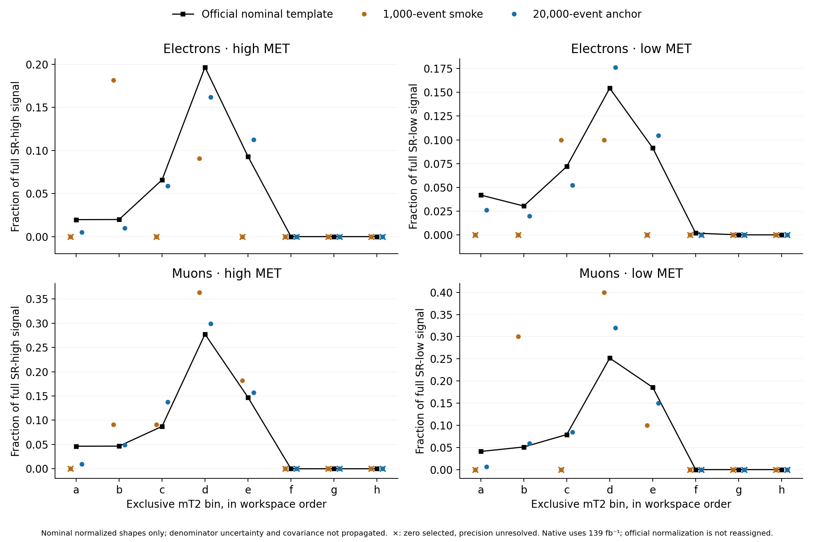
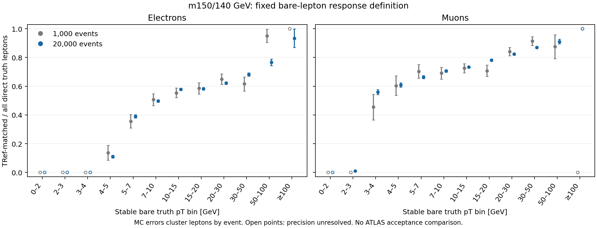

# RRR closure waypoint — 6 September 2026

The retained four-state slepton samples at parent/LSP masses **150/140 GeV** completed all twelve native stages, including six numerically resolved 95% CLs limit roots. The 20,000-event anchor gives conditional physical cross-section limits of **48.8255 fb observed** and **54.6857 fb median expected**, respectively **+4.70%** and **−3.26%** relative to the published point. Its reconstructed-fraction diagnostics are lower by **11.12% / 10.62%** in high/low SRs than the public algebraic acceptance-times-efficiency products, with about **7% / 8% own-MC error** and unresolved comparison definitions. This is one completed mass point with two event samples. It is **not full RRR reproduction, acceptance validation, statistical coverage validation, or a physics certificate**.

This small public bundle preserves the saved numerical results, likelihood operands, channel moments, all-event response summaries and source hashes behind that statement. Large event records and installed tools remain outside the bundle. Original scientific files were read without alteration. No generation or limit fit was run to curate this record.

## Results and exact comparison basis

| Sample | Generated events | Observed μ95 | Median expected μ95 | Conditional observed σ95 [fb] | Conditional median expected σ95 [fb] | Observed residual | Median expected residual |
|---|---:|---:|---:|---:|---:|---:|---:|
| Smoke2 | 1,000 | 0.2056216795 | 0.2142919198 | 32.77070 | 34.15251 | −29.73% | −39.58% |
| Anchor | 20,000 | 0.3063582660 | 0.3431289194 | 48.82547 | 54.68574 | +4.70% | −3.26% |
| Published reference | — | — | — | 46.633 | 56.526 | — | — |

The conversion is `σ95[fb] = μ95 × 0.1350625[pb] × 1.18 × 1000[fb/pb]`.
Its reference rate is therefore **159.37375 fb**. Residuals are `(native − published) / published`. The inclusive LO rate comes from a separate source-bound, zero-matrix-element-jet four-state generator control, with 1,000 retained events and reported integration uncertainty 0.0003703 pb. Only that control's four generation-prefix stages completed; it did not run a detector or a likelihood. Its failed zero-rate attempt and the sole corrective `ptj1min=0` change are retained in the source summary. The declared K factor 1.18 is a modeling operand, not a newly measured higher-order correction.

The signal templates instead use tagged one-matrix-element-jet LO rates, 0.034833304 pb and 0.034566716 pb for smoke2 and the anchor, with K=1.18 and luminosity **139 fb⁻¹**. The reported physical conversion is conditional on this inclusive four-state interpretation. It adds no luminosity factor. It does not infer an inclusive rate from the tagged cross section or assign a luminosity to the official signal patch.

The public point is row 22 of the source limit table, whose coordinates are **parent mass 150 GeV and mass difference 10 GeV**, giving LSP mass 140 GeV. Observed 0.046633 pb and median expected 0.056526 pb come from [HEPData Figure 44ab](https://doi.org/10.17182/hepdata.91374.v5/t91). [published-limits-52.json](published-limits-52.json) preserves all 52 reference-matched Δm≥2 GeV points, the full comparison denominator for later work. This subset is not described as the RRR author lattice. Public expected bands and per-point uncertainties are not supplied and remain null. One-point agreement cannot establish a plane-wide residual distribution.

## Numerical result and what was independently checked

Both saved fits resolve the observed and five expected roots. Each producer performed **16 fresh, ordered root/bound checks**. Maximum absolute deviation from CLs=0.05 was 3.5856242×10⁻⁶ for smoke2 and 8.1889149×10⁻⁶ for the anchor, below the recorded 0.0005 tolerance. All numerical scan arrays, brackets and fit diagnostics remain in [fits/](fits/), with local execution provenance removed into a separate, explicitly scoped summary.

An independent fixed-parameter check reproduced the anchor's 217-parameter, 38-channel likelihood with NumPy. It evaluated **18 parameter points at three signal-unit scales, for 54 comparisons**. Scaling nominal signal and its absolute MC errors together while mapping μ inversely preserved expected data and twice-negative-log-likelihood to 7.11×10⁻¹⁵ and 2.28×10⁻¹³ absolute error. Scaling nominal signal alone changed auxiliary data by 183 and was rejected. These are identities at tested parameter points; unchanged finite POI bounds do not establish global equivalence of optimization domains.

At the retained free-fit vector, independent NumPy evaluation agreed with the saved JAX objective within 4.3×10⁻¹². A finite-difference projected-gradient check was approximately 9.07×10⁻⁵. The six stored root values/brackets and sixteen logged checks were reconciled. **Conditional/root nuisance vectors were not retained**, so the reviewer did not independently recompute those minima or establish global optima. No fresh minimization, CLs root search, coverage study or physics certification was performed. See [diagnostics.json](diagnostics.json).

The execution receipt's Python version describes its supervisor. The actual fit interpreter is the separate interpreter named in the recorded command; these must not be conflated. [execution-provenance.json](execution-provenance.json) keeps that distinction and all twelve retained successful stage records.

## Signal model, shapes and finite MC precision

The likelihood contains **32 exclusive SR bins and six CR bins**, with opt-in per-bin signal `shapesys` constraints derived from actual sumw/sumw². The inherited background and its correlations are retained. [channels.csv](channels.csv) contains all 76 sample/channel rows, including zeros, native counts and moments, official constraint information, and explicitly missing official raw counts/sumw². Official nuisance-implied effective counts are not generator event counts.

| Anchor region | Selected events | Conventional relative MC error | Zero-selected bins |
|---|---:|---:|---:|
| SR high | 204 | 7.00% | 6 / 16 |
| SR low | 153 | 8.08% | 6 / 16 |
| SR combined | 357 | 5.29% | 12 / 32 |
| Six CRs | 85 | 10.85% | 0 / 6 |

The **≤5% own-MC requirement is unmet** even for combined SR yield; individual occupied bins can be far less precise. Zero-selected bins are precision-unresolved, with no fabricated nuisance or certified zero error. For these positive uniform-weight samples, 1/√N is the conventional independent-event, Poissonized weighted-histogram approximation. It is not an exact fixed-generated-N binomial error or the uncertainty of the generator integration. Detector, trigger, ISR and theory variations have not been validated.

### Conditional reconstructed-fraction comparison

The near-5% limit agreement does not remove the reconstructed-fraction discrepancy. [reco-fraction-diagnostics.json](reco-fraction-diagnostics.json) retains the source-bound calculation
`(tagged LO σ / inclusive LO σ) × (selected weight / total generated weight)`.
For these uniform positive-weight samples, the last factor is selected events divided by original generated events. K and luminosity cancel; this is separate from raw official-template yields or a 139/140 luminosity adjustment.

| Anchor region | Estimated inclusive four-state reconstructed fraction | Public algebraic A×efficiency | Central residual | Conditional sampling error on native fraction |
|---|---:|---:|---:|---:|
| SR high | 0.002610498867 | 0.002937036246 | −11.1179% | 0.000181836955 (6.97%) |
| SR low | 0.001957874150 | 0.002190480171 | −10.6190% | 0.000157678142 (8.05%) |

The native sampling errors here use the nested-mask covariance conditional on a fixed generated rate; they are slightly smaller than the Poissonized yield errors above. Inclusive integration uncertainty (0.2742%) is reported separately. Generator-rate correlation, ISR/detector/theory variations and public uncertainty are not inferred. Smoke2 gives −3.41% / +17.74% central differences with much poorer sampling precision, and remains in the same artifact.

The Figure 32 acceptance display has a **10⁻³ multiplier**, whereas efficiency is a fraction. [public-acceptance-efficiency-52.json](public-acceptance-efficiency-52.json) preserves all source factors, units, row indices and unknown quantities. Its A×efficiency value is an **algebraic target**: the exact truth/filter denominator, reconstruction migration definition and correspondence to the unmerged one-parton sample remain unresolved. These central residuals are therefore diagnostic, not a scored acceptance closure test; missing public errors remain null. The verifier recomputes both rate and selected-population factors, target products, residuals and conditional sampling errors from bundled operands and checks their original source pins when rebuilding.

The anchor's nominal normalized-shape total-variation distances are 0.1034 in high SRs, 0.1175 in low SRs, and 0.3931 in the six CRs. These describe the recorded templates; no significance or propagated covariance band is inferred. The official patch's luminosity and cross-section normalization are not assigned, so raw native/official yield ratios are **not efficiency ratios**. Public cutflow yields are separately labeled **140 fb⁻¹**; their raw counts are separate columns and do not provide weighted sumw². See [public-cutflows-m150-m140.json](public-cutflows-m150-m140.json) and [native-cutflows.csv](native-cutflows.csv).



This retained diagnostic figure shows normalized nominal templates. Denominator uncertainty and covariance are not propagated into its curves. Prepared signal-CR and signal-MC omission controls were not fitted in this waypoint and are not reported as executed comparisons.

## Object and selection diagnosis

The bare direct-lepton response diagnostic joins all **1,000/1,000** and **20,000/20,000** raw input events to the native event records. It validates the declared four-state topology, ancestry and unique same-event stored TRef mapping in a single stored TProcessID namespace. The anchor matches **9,690/20,002 direct electrons** and **14,033/19,998 direct muons**, with per-event cluster delta-method ratios/errors about 0.48445±0.00357 and 0.70172±0.00328. Extra-origin reconstructed leptons remain separately counted. An independent full PyROOT pointer/ancestry check covered the **1,000-event sample only**; it is not advertised as a second independent all-20k proof.

These are conditional **bare-lepton reconstruction diagnostics**, not ATLAS truth acceptance. They omit photon dressing, required truth-jet construction, trigger and author-16 behavior, and experimental truth matching. Event-level native joins do not establish native per-lepton truth identities. Zero/boundary, one-cluster and zero-empirical-variance response bins remain precision-unresolved. The exact comparison quantity and inclusive/filter basis required for public Figure 32 acceptance are unresolved.



The b-tag transfer check covers 20,000 events and **46,010 stored jets**. One generic Delphes BTag Boolean is transported into all **12 named SimpleAnalysis working-point flags**, including the requested `BTag85MV2c10`. Transport is consistent; an MV2c10 85% calibration is **not established**. The paper's 85% reference working point and c/light rejection figures are population-dependent calibration definitions, not constant per-jet probabilities. Primary locations and source hashes are in [btag-source-pins.json](btag-source-pins.json).

Native b-veto survival 2,598/2,735≈0.950 versus the public weighted 611.05/705.86≈0.866, together with low native top-CR yields, motivates investigation. Different earlier populations, overlap removal, ISR and production/normalization prevent attribution to tagging alone. A defensible response control requires a pinned calibration, flavor/kinematic support, bit mapping, selection order, and paired migration/covariance evidence. No production response was tuned to the public cutflow.

The same-object RISR oracle covers 15,526 preselected anchor events and 6,928 two-lepton events. Installed public-code and native predicates have **zero high/low migrations** after prior cuts. Reading the differing HEPData label literally gives 106 high-region migrations; that does not prove ATLAS executed that literal label. A physical boundary control exposed CSV rounding of a value below one to exactly one. A separate round-trip-precision candidate repairs serialization and changes none of the anchor's high/low decisions. **That candidate was not substituted into the frozen anchor binary.** This is graph/formula/serialization agreement on shared objects, not independent detector or full-physics validation.

## Public verification and reproduction limits

From a public checkout, using Python 3.12 or later:

```sh
python evidence/audits/2026-09-06-rrr-waypoint/curate.py
python evidence/audits/2026-09-06-rrr-waypoint/curate.py --units
python -m pytest evidence/audits/2026-09-06-rrr-waypoint/test_curate.py
```

The default check uses only the standard library. It verifies bundle membership and hashes, lossless compressed likelihood operands, no local absolute home/scratch paths, reference/channel/event denominators, saved root-check tolerances, conditional cross-section arithmetic, and channel sumw/sumw² algebra. `--units` additionally requires NumPy, pyhf 0.7.6 and jsonpatch and runs the 54 fixed-parameter comparisons plus the negative control. It invokes no optimizer. Tests should run outside the research checkout if its historical `py.py` shadows pytest dependencies.

Retained-source verification and deterministic regeneration are explicit:

```sh
python evidence/audits/2026-09-06-rrr-waypoint/curate.py --source-root /path/to/retained-checkout
python evidence/audits/2026-09-06-rrr-waypoint/curate.py --rebuild --source-root /path/to/retained-checkout
```

`--source-root` checks the original small files listed in [source-provenance.json](source-provenance.json). Those campaign/local-review files are generally absent from the public export, so this mode should fail there rather than downgrade to public-only verification. Rebuilding regenerates transformed JSON/CSV from those sources and copies the already-produced figures; it does **not** rerun the physics or recreate plots from raw events.

[manifest.json](manifest.json) records each distributed file's hash, transformation and source mapping. Compressed background and signal patches recover their exact original JSON bytes. Saved fits retain all numerical fields but omit local execution provenance. Other selected JSON removes repository-root prefixes while preserving an exact original-source byte pin. Large ROOT/LHE/HepMC/trace files, binaries, toolchain environments, full external source trees and private authorization records are not distributed. Their existence or a recorded receipt hash is not proof available to a public reader. This bundle provides auditable derived evidence, **not complete public raw-event custody**; no source download, large-file rehash, full ancestor replay, new fits or certificate is implied by a green bundle check.

## Inspect or reconstruct the explicit recipe

[recipe/](recipe/) ships the anchor's **five byte-exact physics cards** and a portable TOML template. Only the statistical-interpreter and likelihood paths are rewritten; the original config hash and preserved settings are source-bound and checked. Its short [instructions](recipe/README.md) copy to a new run, decompress the exact background, require the user's explicit JAX-interpreter path, and show the read-only native plan command. No compute approval or execution is implied. This makes the scientific recipe inspectable after native/JAX setup, without claiming a complete environment lock, bitwise reproduction, or public access to omitted raw events. The frozen-versus-current RISR serialization difference is explicitly retained.
