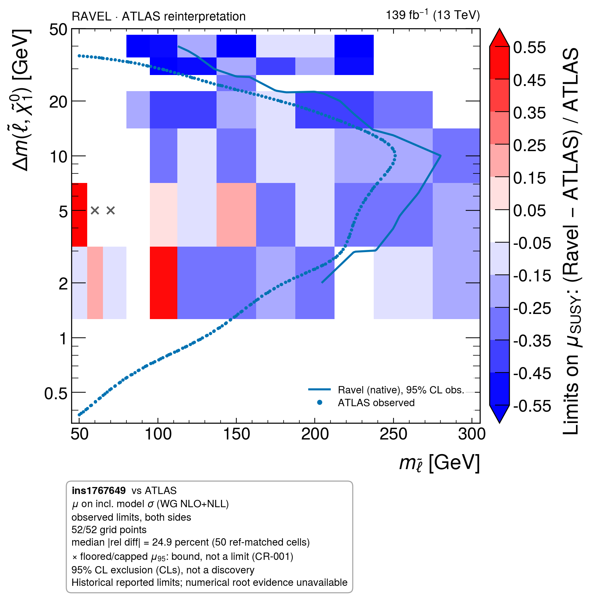

# Irregular contour support: unchanged historical physics

This is a fresh rendering of the **historical 52-point scan**, not an updated
physics result. Its 50 comparable observed limits still have a 24.9% median
absolute residual. The historical red cells and broad blue bias remain visible.
Fresh-anchor and fixed-template refit results have not been mixed into this map.



[Expected panel](scan__fig3_expected.png) · [Population and residuals](scan__reldiff.json) ·
[Input/output hashes](provenance.json) · [Rendering log](render.log)

The previous contour construction inferred missing nodes by completing a rectangle
around the scan. On an irregular boundary, some inferred nodes were outside the
actual grid's convex hull; masking their triangles broke supported contour pieces.
Missing-node inference is now limited to the convex hull in the plotted coordinate
system. Invalid or genuinely missing interior nodes still mask their triangles.
Interpolation remains piecewise linear, and the repair changes no point's limit,
residual, status or observed/expected identity.

The logarithmic axis uses legible 1–2–5 ticks and the header identifies a RAVEL
reinterpretation with beam energy and luminosity. The observed PNG was visually
inspected after rendering. Regression cases cover irregular boundaries on linear
and logarithmic axes and ensure failed boundary vertices stay masked.

```bash
python benchmarks/plot_scan_demo.py --out NEW_OUTPUT_DIRECTORY
```

The cached [reference inputs and their provenance](../2026-09-05-scan-fidelity/README.md)
are unchanged. The new PNG/PDFs were rendered with the existing mplhep runtime;
the strict house-style checks passed. A cleaner contour is a presentation repair,
not evidence that the signal simulation now agrees with ATLAS.
