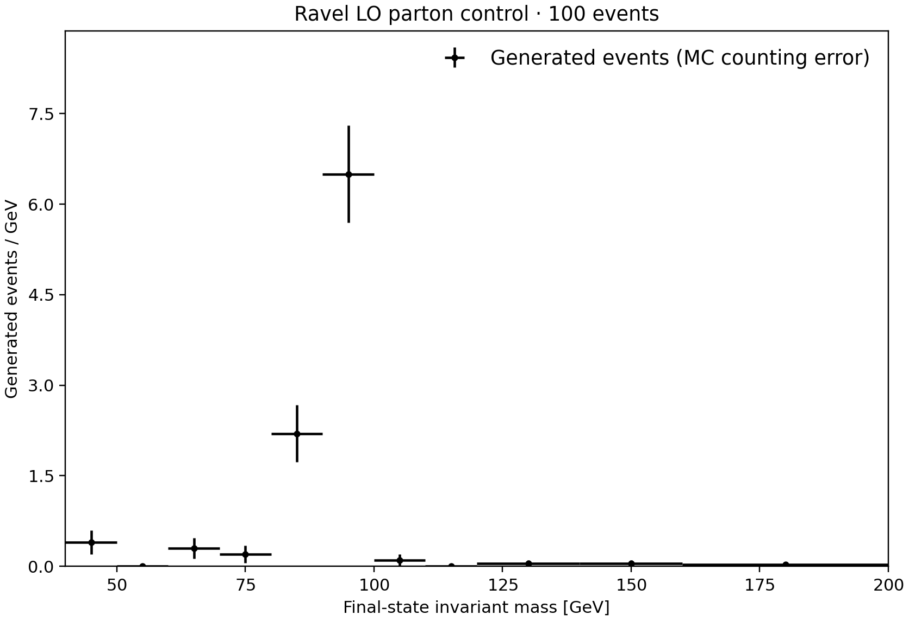
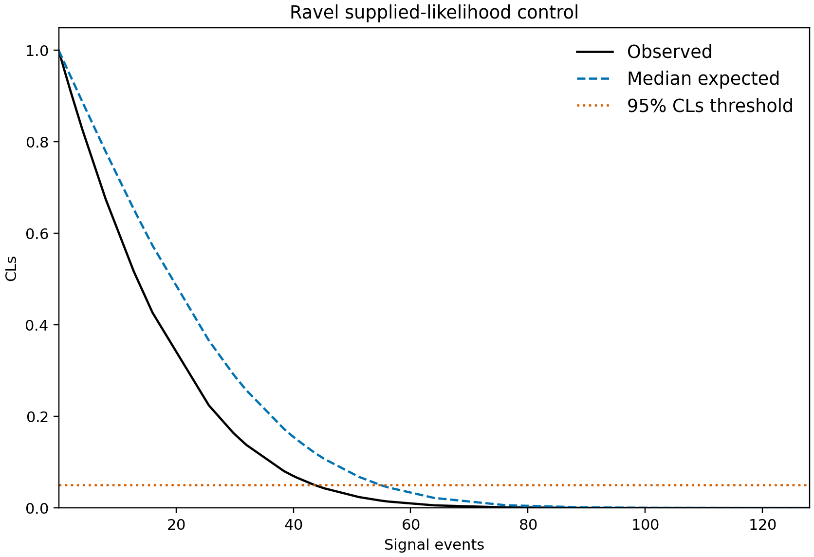

# Priority 1: executable scoped workflows

Ravel now completes bounded generation-only and supplied-likelihood requests through its
installed CLI. These controls test concrete planning, approval, execution, scientific
postconditions, figures, status, reuse and recipe comparison. They do not establish a new
autonomous-agent success rate, detector fidelity or RRR reproduction.

## What ran

All controls used explicit, user-authorized scripted YES after a concrete CHECK-IN 1,
one worker and a 120-second ceiling per attempt. This is experimental assent, not substantive
expert review. Native generation used MadGraph 2.9.27 on macOS ARM64. The inference runtime
used CPython 3.12.13, pyhf 0.7.6, NumPy 1.26.4, SciPy 1.14.1 and iminuit 2.32.0.

| Control | Result | Interpretation |
|---|---|---|
| ATLAS 2jl counting approximation | 43.65137 observed; 54.88440 median expected signal events | Complete scoped CLI workflow; six crossings resolved |
| Identical counting replica | Same six limits | Recipe equivalence passes; completed resume spends no new attempt |
| Supplied two-bin workspace | μ95 = 1.35655 observed, 1.40051 median expected | Binwise background constraints plus a shared signal-normalization nuisance; synthetic architecture control |
| POI cap deliberately limited to 10 | All six crossings remain above the scan | Delivery fails; bounds and diagnostics remain, converted cross-section limits are empty, retry is refused |
| Drell–Yan, seed 1729, scale choice 4 | 100 events; 760.535 ± 6.492 pb | Full event audit and scoped lifecycle pass |
| Drell–Yan, seed 1730, same recipe | 100 events; 761.520 ± 6.525 pb | Sampling changes; recipe-equivalence gate passes |
| Drell–Yan, scale choice 3 | 100 events; 605.070 ± 5.122 pb | Scale mismatch is identified; comparison gate fails |
| Dimuon final state | 100 events; 760.535 ± 6.492 pb | Separate final-state audit passes; comparison to the electron process is refused |
| Explicit supplied parameter card | 100 events; 760.535 ± 6.492 pb | Complete card survives execution; separate adapter check |

Native ± values are generator integration errors, not complete theory uncertainties.
The flavor control deliberately shares its sampling prescription; it is not an independent
MC replica. The counting model is the declared gamma/Poisson-constrained approximation,
not the full ATLAS experimental likelihood. Expected limits use pyhf's conditional
background-only Asimov convention. Numerical agreement does not establish coverage.

The [56-command integration record](commands.json) retains actual command return codes and
timings. Its [summary](summary.json) separates expected negative outcomes from successful
delivery. Changing one output byte invalidated status and comparison; restoring the original
bytes restored validity. The full private runtime snapshots and execution ledgers remain at
their original local run paths; portable execution summaries carry their original hashes.

## Look at the results



The plot shows generated counts divided by bin width, with bin extents and MC counting
errors. It is a 100-event delivery control. The binning, counts and underflow/overflow are
in [figure metadata](drell-yan/figure.json); [vector PDF](drell-yan/figure.pdf) is available.



The curves are display samples. Limits come from verified crossings rather than curve
interpolation. See the [numerical result](counting/result.json), [workspace](counting/workspace.json)
and [PDF](counting/figure.pdf). The [two-bin figure](two-bin/figure.png) and
[workspace](two-bin/workspace.json) exercise a different model structure.

## What the review caught

- The shared schema reader did not enforce declared upper bounds. Runtime, event and seed
  ceilings now have adversarial checks.
- Installed module bootstrap duplicated package discovery, changing the apparent environment
  fingerprint. The [initial failed wheel attempt](initial-wheel-failure.log) stopped before
  physics; the bootstrap and its regression were repaired.
- A successful subprocess alone could have escaped final delivery validation. The CLI now
  requires the scoped scientific and lifecycle checks too.
- Direct worker invocation could have bypassed attempt accounting. A worker now requires its
  active supervisor, parent-process identity and budgeted attempt record.
- An unresolved legacy endpoint could be converted into an unqualified cross-section number
  inside failed diagnostics. Conversion now requires a resolved status for each individual root.
- Variable-width generation bins needed explicit density normalization and bin extents.

Adversarial tests also cover malformed/duplicate JSON, nonfinite values, fractional event
counts, command injection, missing models/restrictions, stale approvals and inputs, symlinks,
budget exhaustion, truncated gzip/XML, wrong beams/PDFs, negative/variable weights, wrong
final states, kinematic and mass-shell inconsistencies, fixed/ineffective POIs, ambiguous
measurements and insufficient numerical ranges. Existing supervision tests cover timeouts,
interruptions, descendant cleanup and partial-output custody.

## Independent checks and reproducibility

[verify.py](verify.py) uses a separate event reader and fresh upstream pyhf/SciPy fits, without
importing Ravel's physics worker. It checks 500 event records (four main controls plus the
supplied-card control) and all 18
resolved statistical roots, the comparison dispositions and the retained unresolved bound.
This is numerical and record verification, not an independent theoretical or detector study.
The [fresh verification result](independent-verification.json) records the crossing residuals.

```sh
python evidence/audits/2026-09-09-scoped-workflows/verify.py
python benchmarks/scoped/run_controls.py --out /tmp/new-controls --scripted-yes
```

The second command requires explicit authorization for scripted assent. Supply `--native-spec`
with reviewed native paths to include the four 100-event generation controls. The
[workflow guide](../../../docs/workflow/reference/scoped-workflows.md) provides installation,
ordinary physicist approval, specifications and failure semantics.

Public LHE headers replace the local home-directory prefix with a neutral path. Event-block
bytes and physics values are unchanged; [projection hashes](event-projection.json) retain
both original and public file identities. Public text cards normalize whitespace and use the
same neutral home prefix in header paths; scientific tokens remain unchanged. The
[card projection hashes](card-projection.json) retain their original and public identities.
The [original small-record hashes](original-record-hashes.json)
and [bundle verification](verification.json) identify the tested projection. Exported copies
are evidence, not portable live approvals; they cannot substitute for a new approved run.

## Remaining limitations

This first native adapter supports unmerged LO proton collisions and builtin cteq6l1, an
installed model/restriction, and a declared final-state invariant-mass observable. NLO/signed
weights, merging, other PDF provisioning, lepton beams, showers, detector simulation, arbitrary
observables and spectrum generation remain explicit product gaps for this route.

The CLI comparison gate currently accepts verified Ravel scoped runs. An external-tool receipt
importer remains work to do. The current checks do not prove optimum fit uniqueness, coverage,
physics-accurate normalization beyond the supplied model, broad prompt comprehension or a
general autonomous workflow. RRR rate/shape/acceptance and generation-cut closure remain open.
