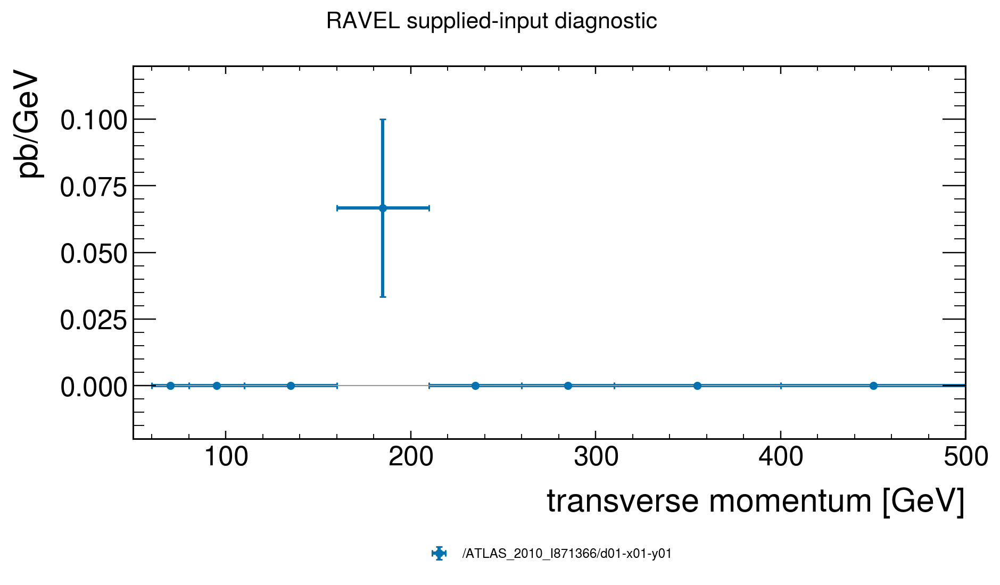

# Scientific adapter result

analyze: passed.

The values, postconditions and limitations are in `result.json`. The exact input identities are in `recipe.json`; review `checkin2.json` before additional work.

Assumptions:

- The events and cross section are synthetic, not a physical prediction.
- The pinned routine is compiled against the explicitly declared runtime; no equivalence with another runtime is assumed.

No paper reproduction or physics certification is inferred.
