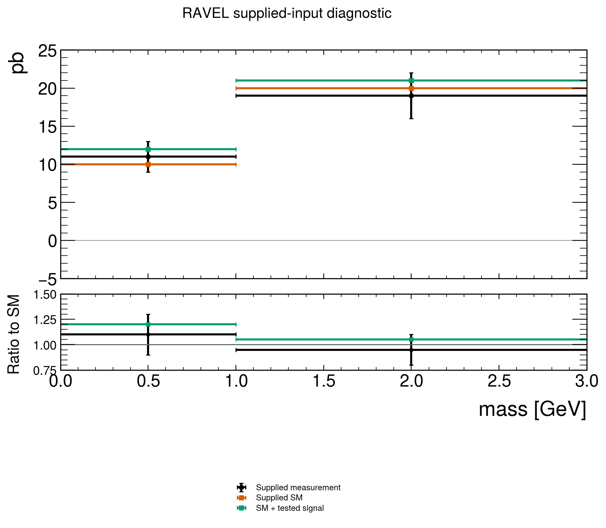

# Scientific adapter result

measurement: failed.

The values, postconditions and limitations are in `result.json`. The exact input identities are in `recipe.json`; review `checkin2.json` before additional work.

Assumptions:

- Synthetic analytic or boundary input. Agreement tests only the declared operation.
- Scripted assent is experimental consent, not expert scientific review.

No paper reproduction or physics certification is inferred.
